# 📡 Complete Computer Networks Handbook with Mermaid Diagrams


## 1. Basics of Computer Networking

### What is Computer Networking?
Computer networking is the practice of **connecting multiple computing devices** so they can exchange data, share resources, and communicate.

**Key Functions:**
- File and resource sharing
- Communication (email, VoIP, messaging)
- Access to remote data
- Internet connectivity

**Example Network Diagram:**
```mermaid
graph LR
  A[PC1] --> S[Switch]
  B[PC2] --> S
  S --> R[Router]
  R --> I[Internet 🌐]
````

---

## 2. Basic Terms

| Term            | Definition                                   |
| --------------- | -------------------------------------------- |
| **Client**      | Requests resources or services from a server |
| **Server**      | Provides resources/services to clients       |
| **Peer**        | Acts as both client and server               |
| **Host**        | Any device with an IP address on a network   |
| **Bandwidth**   | Max data transfer rate                       |
| **Jitter**      | Variation in packet arrival times            |
| **Packet**      | Unit of data at the Network Layer            |
| **Frame**       | Unit of data at the Data Link Layer          |
| **Local Host**  | Loopback address (127.0.0.1)                 |
| **Bit Rate**    | Bits transmitted per second                  |
| **Noise**       | Unwanted signal interference                 |
| **Attenuation** | Loss of signal strength over distance        |
| **Distortion**  | Alteration of original signal                |

---

## 3. Web vs Internet

```mermaid
mindmap
  root((Networking))
    Internet
      Global network infrastructure
      Includes many services
    Web
      Uses HTTP/HTTPS
      Part of the Internet
```

---

## 4. Transmission Media

### Wired

* **Twisted Pair**: Copper cables twisted to reduce noise
* **Coaxial Cable**: Shielded copper, higher bandwidth
* **Fiber Optic**: Uses light for high-speed, long-distance

### Wireless

* **Radio waves**: Wi-Fi, Bluetooth
* **Microwaves**: Long-distance point-to-point
* **Infrared**: Short-range
* **Satellite**: Very large coverage

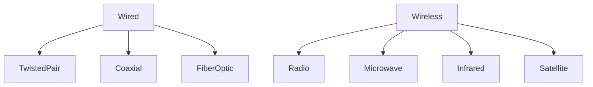

---

## 5. Network Devices

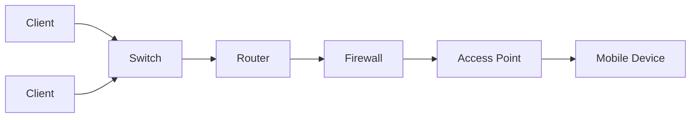

---

## 6. Unicast, Broadcast, Multicast

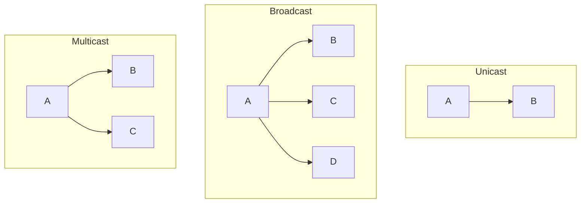

---

## 7. Networking Topologies

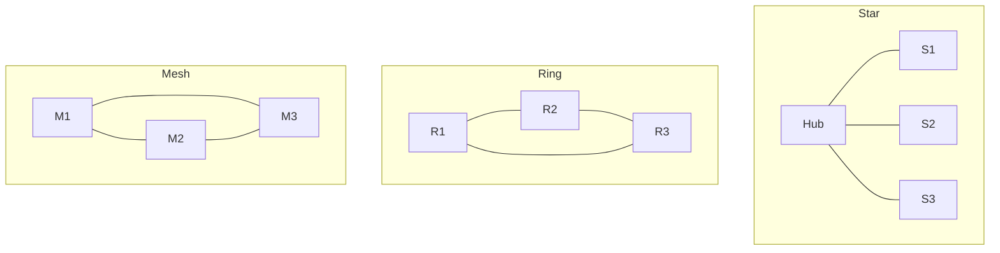

---

## 8. LAN vs MAN vs WAN

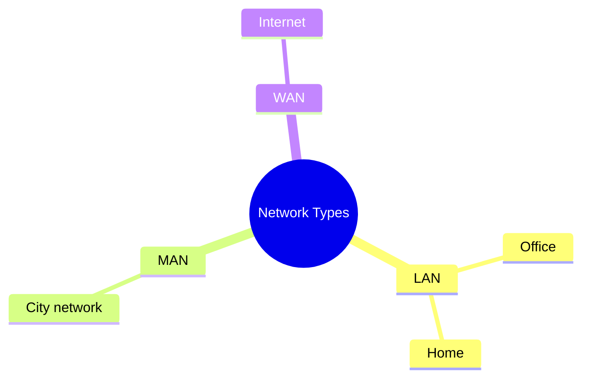

---

## 9. OSI Model (PDNTSPA)

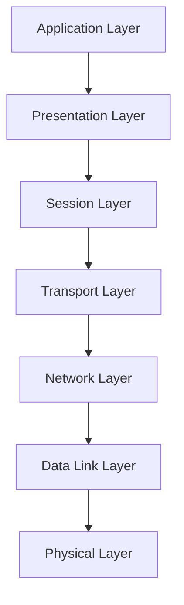

---

## 10. Ethernet

IEEE 802.3 standard for wired networking.

---

## 11. Extranet vs Intranet vs Internet

| Type     | Access                       |
| -------- | ---------------------------- |
| Intranet | Internal only                |
| Extranet | Internal + selected external |
| Internet | Public access                |

---

## 12. Virtual Circuit vs Datagram

* Virtual Circuit: Predefined route, connection-oriented
* Datagram: Independent routing

---

## 13. Switch Types

* **Managed**: Configurable
* **Unmanaged**: Plug and play
* **Layer 3**: Routing capability

---

## 14. VLAN

Logical segmentation of networks.

---

## 15. Wi-Fi Basics

Wireless networking (IEEE 802.11).

---

## 16. IP Addressing

**IPv4**: 32-bit, dotted decimal
**IPv6**: 128-bit, hexadecimal

---

## 17. Supernetting

Combining multiple networks for simpler routing.

---

## 18. Routing Types

* Static
* Default
* Dynamic (OSPF, RIP, BGP)

---

## 19. NAT

Maps private IPs to public IPs.

---

## 20. WPA vs WPS

* WPA: Security protocol
* WPS: Easy setup method (less secure)

---

## 21. Li-Fi vs Wi-Fi

* Li-Fi: Light-based
* Wi-Fi: Radio-based

---

## 22. ACL

Rules controlling traffic.

---

## 23. AAA

Authentication, Authorization, Accounting.

---

## 24. SONET

High-speed fiber optic standard.

---

## 25. TCP Connection Setup (3-Way Handshake)

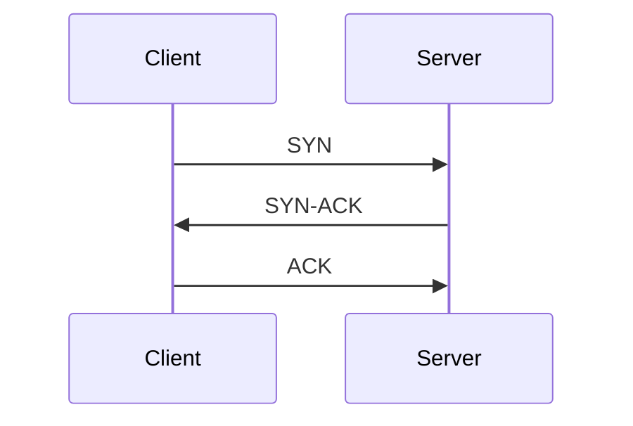

---

## 26. Peer-to-Peer

Direct device-to-device communication.

---

## 27. Congestion

When network demand exceeds capacity.

---

## 28. Error Control

CRC, checksums, retransmissions.

---

## 29. Session, Presentation, Application Layers

* Session: Manages connection state
* Presentation: Data format translation, encryption
* Application: User-level services

---

## 30. DNS

Resolves domain names to IPs.

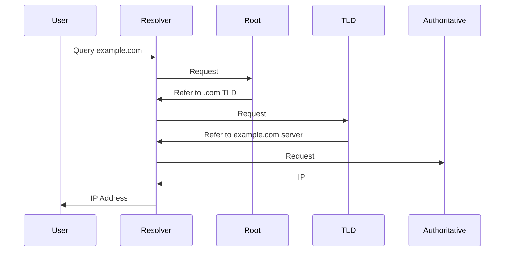

---

## 31. HTTP vs HTTPS

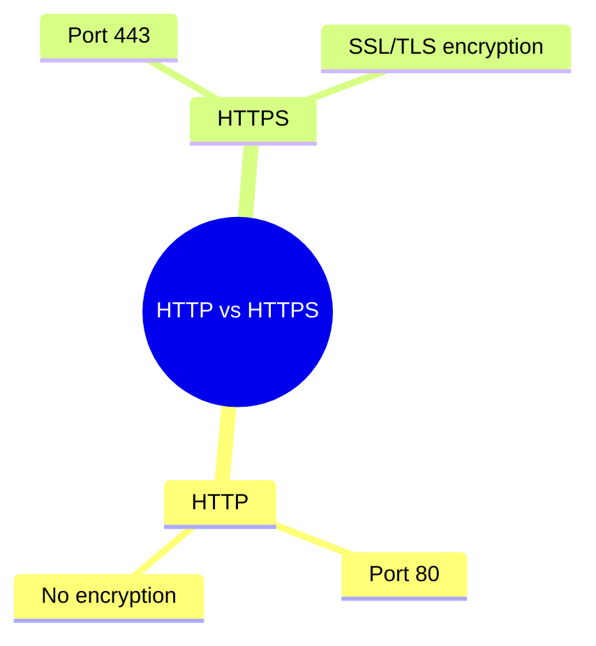

---

## 32. DHCP

Assigns IPs dynamically.

---

## 33. How a Packet Travels

```mermaid
flowchart LR
  App[Application Layer] --> Trans[Transport Layer]
  Trans --> Net[Network Layer]
  Net --> DL[Data Link Layer]
  DL --> Phy[Physical Layer]
  Phy --> Medium
  Medium --> DestPhy[Physical Layer Dest]
  DestPhy --> DestDL[Data Link Layer Dest]
  DestDL --> DestNet[Network Layer Dest]
  DestNet --> DestTrans[Transport Layer Dest]
  DestTrans --> DestApp[Application Layer Dest]
```

---

## 34. Common Commands

`ping`, `netstat`, `tracert`, `ipconfig`, `nslookup`, `route`, `pathping`, `netdiag`, `hostname`, `arp`

---

## 35. API Gateway

Manages and routes API requests.

---

## 36. SSL/TLS

Secure communication protocols.

---

## 37. Reverse Proxy

Intermediary between clients and servers.

---

## 38. Load Balancer

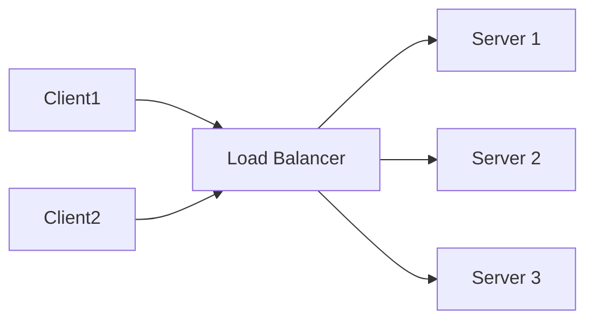

---

## 39. ARP

Resolves IP to MAC addresses.

---

## 40. Scaling

* Horizontal: Add more servers
* Vertical: Upgrade existing server

---

## 41. Caching

Stores frequent data for faster access.

---

## 42. VIP

Virtual IP address for redundancy/load balancing.

---

## 43. REST API vs HTTP API

REST follows constraints; HTTP API is any API over HTTP.

---

## 44. Containers

Lightweight isolated app environments.

---

## 45. Containerization vs Virtualization

* Containerization: OS-level isolation
* Virtualization: Hardware-level isolation

---

## 46. Performance vs Scalability

Performance = speed; scalability = growth handling.

---

## 47. Latency vs Throughput

Latency = delay; throughput = rate of data transfer.

---

## 48. 2G to 5G

Increasing speed, lower latency, better capacity.

---

## 49. VPN

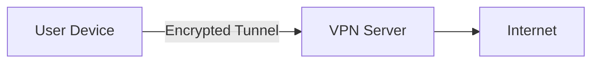

---

## 50. Gateway vs Router

* Gateway: Connects different network protocols
* Router: Connects similar networks

---

## 51. NIC & MAC

NIC = Network Interface Card
MAC = Hardware address

---

## 52. Public vs Private IP

Public = Globally routable
Private = Local only

---

## 53. Multiplexing

Combining multiple signals on one channel.

---

## 54. Modem vs Router

* Modem: Converts ISP signal to digital
* Router: Directs traffic between networks

---

## 55. Bluetooth

Short-range wireless communication.

---

## 56. Hotspot

Shares internet over Wi-Fi.

---

## 57. Email

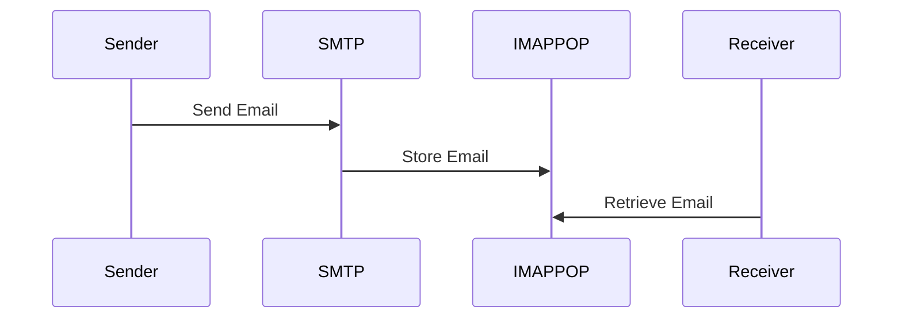

---

## 58. File Transfer

Uses FTP, SFTP.

---

## 59. ATM

Secure bank transaction terminals.

---

## 60. Firewall

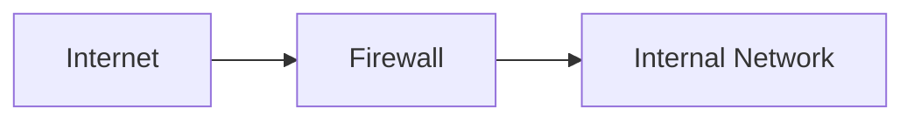

---

## 61. Network Attacks

DoS, DDoS, MITM, phishing.

---

## 62. Cryptography Terms

* Symmetric key
* Asymmetric key
* Hashing
* AES/DES/RSA
* MD5

---

## 63. Active vs Passive Attacks

* Active: Alters communication
* Passive: Eavesdrops

---

## 64. Email Attacks

* Phishing
* Spoofing
* Malware

