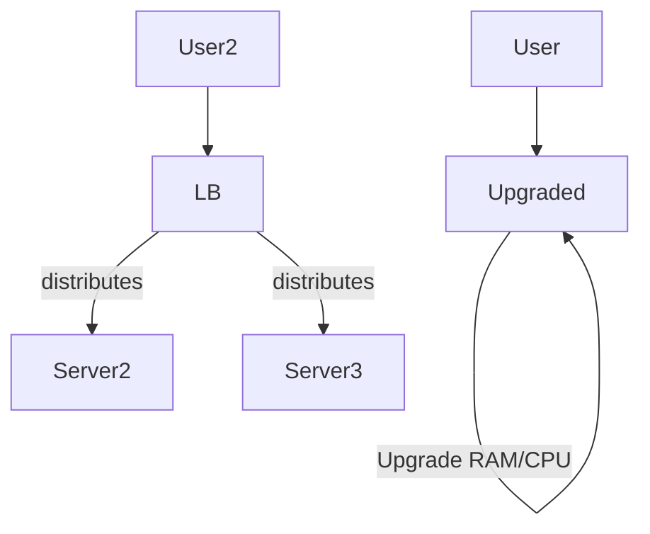
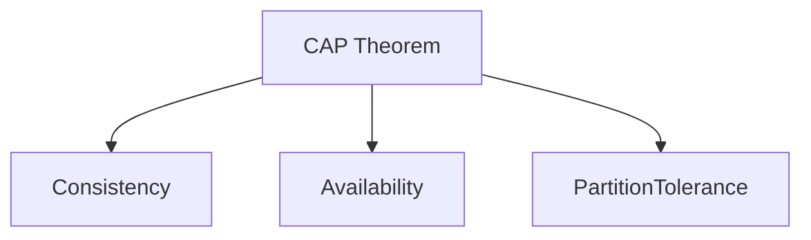
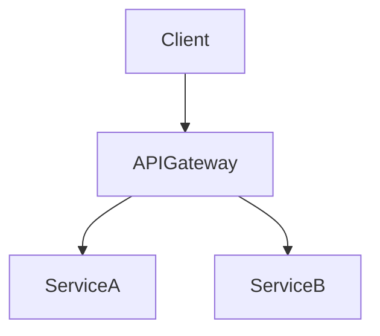
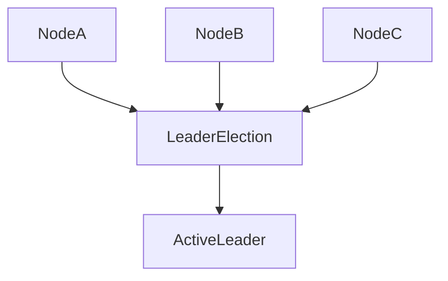
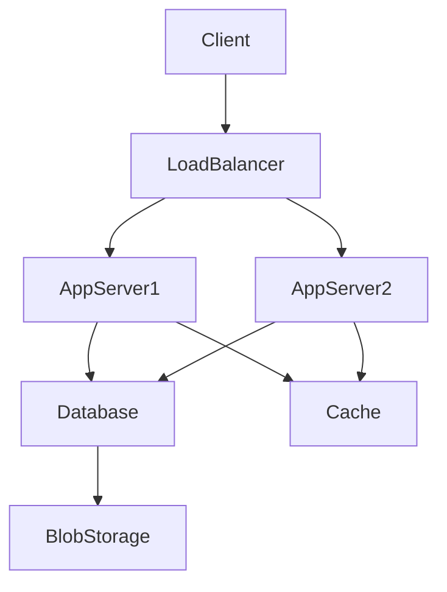

# System Design Blog — Comprehensive Guide

## Table of Contents

1. [Why study System Design?](#1-why-study-system-design)
2. [What is a Server?](#2-what-is-a-server)
3. [Latency and Throughput](#3-latency-and-throughput)
4. [Scaling and its Types](#4-scaling-and-its-types)
   - Vertical Scaling
   - Horizontal Scaling
   - Auto Scaling
5. [Back-of-the-envelope Estimation](#5-back-of-the-envelope-estimation)
6. [CAP Theorem](#6-cap-theorem)
7. [Scaling of Database](#7-scaling-of-database)
   - Indexing
   - Partitioning
   - Master-Slave Architecture
   - Multi-master Setup
   - Database Sharding
   - Disadvantage of Sharding
8. [SQL vs NoSQL Databases](#8-sql-vs-nosql-databases)
   - SQL Database
   - NoSQL Database
   - Scaling in NoSQL vs SQL
   - When to Use Which Database?
9. [Microservices](#9-microservices)
   - Monolith vs Microservice
   - Why Break into Microservices?
   - When to Use Microservices?
   - Client Requests in Microservice Architectures
10. [Load Balancer Deep Dive](#10-load-balancer-deep-dive)
11. [Caching](#11-caching)
12. [Blob Storage](#12-blob-storage)
13. [Content Delivery Network (CDN)](#13-content-delivery-network-cdn)
14. [Message Broker](#14-message-broker)
15. [Apache Kafka Deep Dive](#15-apache-kafka-deep-dive)
16. [Realtime Pubsub](#16-realtime-pubsub)
17. [Event-Driven Architecture (EDA)](#17-event-driven-architecture-eda)
18. [Distributed Systems](#18-distributed-systems)
19. [Auto-Recoverable System using Leader Election](#19-auto-recoverable-system-using-leader-election)
20. [Big Data Tools](#20-big-data-tools)
21. [Consistency Deep Dive](#21-consistency-deep-dive)
22. [Consistent Hashing](#22-consistent-hashing)
23. [Data Redundancy and Data Recovery](#23-data-redundancy-and-data-recovery)
24. [Proxy](#24-proxy)
25. [How to Solve Any System Design Problem](#25-how-to-solve-any-system-design-problem)

## 1. Why Study System Design?

System design helps build **scalable, reliable, and maintainable** software systems. It is essential for:

- Designing robust systems for millions of users.
- Solving real-world challenges in distributed and cloud-native architectures.
- Succeeding in tech interviews and engineering roles.

## 2. What is a Server?

A **server** is a computer program or device that provides services to other programs or devices, known as clients, over a network.

_Servers handle:_

- Web hosting
- Database services
- File storage and more

## 3. Latency and Throughput

| Term       | Definition                                                         |
| ---------- | ------------------------------------------------------------------ |
| Latency    | Time for a request to go from source to destination and back (ms). |
| Throughput | Number of requests/transactions processed per second or minute.    |

## 4. Scaling and Its Types

### Vertical Scaling

- Add more CPU, RAM to a single machine (“Scaling Up”).
- Simpler for applications not built for multi-node setups.
- Limited by hardware limits.

### Horizontal Scaling

- Add more machines/instances (“Scaling Out”).
- Applications must support distribution of data & traffic.
- Preferred for cloud environments.

### Auto Scaling

- Dynamically add or remove resources based on demand (e.g., AWS Auto Scaling).

**Flow Diagram: Vertical vs Horizontal Scaling**

## 5. Back-of-the-envelope Estimation

A quick way to check **system feasibility** by computing:

- Requests per second
- Data size & bandwidth requirements
- Hardware/storage costs

_Example_: If each user sends 1KB/request and 1M requests/day, estimate traffic and storage needs.

## 6. CAP Theorem

The **CAP Theorem** states that a distributed system can only guarantee two of:

- **Consistency**: Every read gets the latest write.
- **Availability**: Every request receives a response.
- **Partition Tolerance**: The system continues to operate despite network partitions.

_Diagram:_

## 7. Scaling of Database

| Technique          | Description                                                        |
| ------------------ | ------------------------------------------------------------------ |
| Indexing           | Speeds up retrieval using keys or indexes.                         |
| Partitioning       | Splits data into separate ranges/segments.                         |
| Master–Slave       | One master handles writes; replicas (slaves) handle reads.         |
| Multi-master       | Multiple nodes can handle writes—more complex conflict resolution. |
| Sharding           | Database split into smaller, easily managed parts (shards).        |
| Disadvantage Shard | Complex joins, higher maintenance, data consistency issues.        |

## 8. SQL vs NoSQL Databases and When to Use Which

| Feature         | SQL                 | NoSQL            |
| --------------- | ------------------- | ---------------- |
| Data Model      | Relational (tables) | Flexible, varied |
| Schema          | Fixed               | Dynamic          |
| ACID Compliance | Yes                 | Often no         |
| Scalability     | Vertical            | Horizontal       |

- **Use SQL** for transactional data needing ACID, complex queries.
- **Use NoSQL** for unstructured/varied data, high write throughput, scale-out needs.

## 9. Microservices

### What is Monolith and Microservice?

- **Monolith:** One unit of deployment; all business logic in a single system.
- **Microservice:** Multiple independent modules; each handles a specific feature.

### Why Break into Microservices?

- Isolate failures and deploy independently.
- Scale individual components as needed.

### When to Use Microservices?

- For large, complex, or rapidly growing products.

### How Clients Request in Microservice Architecture

Usually through an **API Gateway** that routes requests to the correct service.

## 10. Load Balancer Deep Dive

### Why Load Balancer?

- Evenly distribute traffic across backend systems.
- Improve reliability, fault tolerance, and performance.

### Load Balancer Algorithms

- **Round Robin:** Rotates requests among servers.
- **Least Connections:** Goes to server with fewest active connections.
- **IP Hash:** Assigns requests to servers based on client IP.

## 11. Caching

### Caching Introduction

Caching stores frequently accessed data for **faster retrieval**.

### Benefits of Caching

- Reduces database load
- Improves latency

### Types of Caches

- In-memory (Redis, Memcached)
- Browser and CDN caches

#### Redis Deep Dive

- An in-memory key-value data store.
- Supports persistence, pub/sub, advanced data types.

## 12. Blob Storage

### What is a Blob, and Why Blob Storage?

- **Blob:** Binary Large Object (e.g., images, videos)
- Required for efficiently storing unstructured or large files.

### AWS S3

- Widely used, highly durable **object storage** in the cloud.

## 13. Content Delivery Network (CDN)

### CDN Introduction

Distributes data geographically for **faster access** to users.

### How Does CDN Work?

- User request routed to nearest CDN edge server.
- If content cached, serves instantly; else fetches from origin.

### Key Concepts

- Edge servers
- Cache invalidation
- Origin server

## 14. Message Broker

### Asynchronous Programming

Producers and consumers operate independently—helps handle spikes.

### Why Use Message Broker?

- Decouples components for better scalability and fault tolerance.

### Message Queue vs Stream

| Property  | Queue (e.g., RabbitMQ) | Stream (e.g., Kafka)        |
| --------- | ---------------------- | --------------------------- |
| Delivery  | Once, FIFO             | Append-only log, replayable |
| Consumers | Each message to one    | Multiple, independent       |

## 15. Apache Kafka Deep Dive

### When to Use Kafka

- Large-scale, real-time event ingestion pipelines.

### Kafka Internals

- **Producer**: Sends data.
- **Broker**: Holds data.
- **Consumer**: Reads data.
- **Partition**: Splits topic for scaling.

## 16. Realtime Pubsub

Supports instant event or message delivery from publishers to subscribers (e.g., chat, push notifications).

## 17. Event-Driven Architecture (EDA)

### Introduction

Systems revolve around events rather than direct calls.

### Why Use EDA?

- Decoupling
- Good scalability & responsiveness

### Simple Event Notification

- Producer notifies subscribers when something happens.

### Event-Carried State Transfer

- Events contain the actual data/state so consumers don't need to query again.

## 18. Distributed Systems

Multiple independent computers working toward a common goal, appearing as a single powerful system to users.

## 19. Auto-Recoverable System using Leader Election

Ensures **only one primary node** controls a process at a time; others are standby.

## 20. Big Data Tools

- **Hadoop:** Batch processing & storage
- **Spark:** Fast, in-memory data processing
- **Hive:** SQL on Hadoop

## 21. Consistency Deep Dive

| Type                 | Features                        | Use Case               |
| -------------------- | ------------------------------- | ---------------------- |
| Strong Consistency   | Always latest data              | Banking, orders        |
| Eventual Consistency | May see old data, but converges | Social feed, messaging |

_Ways to achieve:_

- **Strong:** Paxos, Raft algorithms
- **Eventual:** Gossip protocol, vector clocks

## 22. Consistent Hashing

Distributes data evenly across nodes, **minimizes rehashing** when nodes are added/removed.

## 23. Data Redundancy and Data Recovery

### Why Redundancy?

Provides **fault tolerance** and **disaster recovery**.

### Different Ways of Doing Data Backup

- Snapshots
- Replication
- RAID
- Regular backups

### Continuous Redundancy

- Real-time replication, hot-hot standby.

## 24. Proxy

### What is a Proxy?

Server that sits between client and other systems.

### Forward Proxy

Acts for _clients_; often used for content filtering, privacy.

### Reverse Proxy

Acts for _servers_; load balances, increases security.

### Building a Reverse Proxy

Receives requests, decides which backend server to forward to.

## 25. How to Solve Any System Design Problem

1. Gather requirements (features, scale, constraints)
2. Define interfaces and assumptions
3. Choose tech stack & high-level architecture
4. Deep dive into components: scaling, consistency, bottlenecks
5. Design for faults, backup, security
6. Summarize solution & present diagrams/tables

### System Design Example Table

| Component     | Function            | Scaling    | Fault Tolerance  |
| ------------- | ------------------- | ---------- | ---------------- |
| Load Balancer | Distributes traffic | Horizontal | Multi-instance   |
| App Servers   | Handle logic        | Horizontal | Auto replacement |
| DB            | Stores data         | Sharding   | Replicas         |
| Cache         | Fast reads          | Clustering | Redis Sentinel   |

### Example System Flow Diagram

