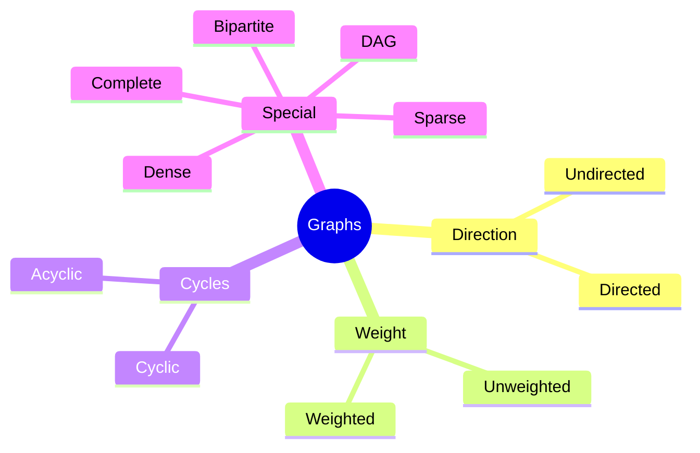
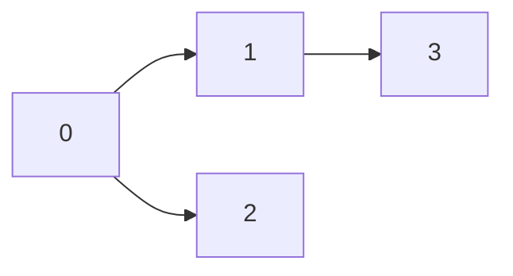
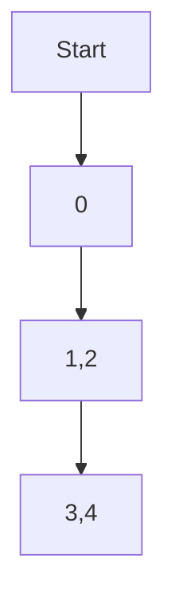
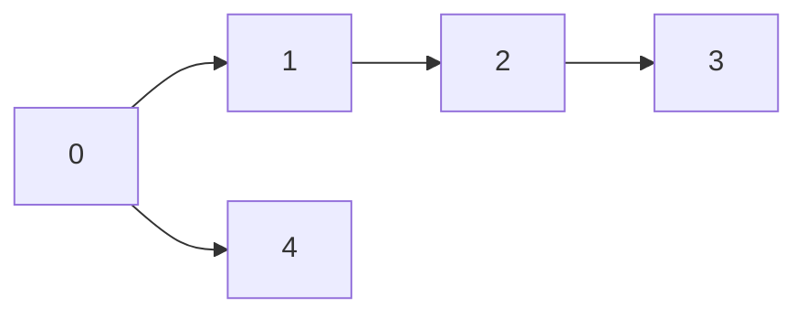
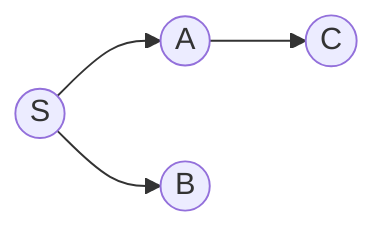

# 🕸️ Graph Data Structures — Complete Notes (C++)

*All content below is in **Markdown** and includes **Mermaid diagrams** and **C++ implementations** (modern C++17/C++20 style, using STL). Save as `.md` and render Mermaid where supported.*

---

## Contents (quick map)

1. What is a Graph
2. Types of Graphs (with diagram)
3. Graph Representations (adjacency list, matrix, edge list) + pros/cons + C++ code
4. Basic Operations & Utilities (add/remove edges, iterate neighbors)
5. Traversals: BFS & DFS (theory + C++ + diagrams)
6. Shortest Paths: Dijkstra, Bellman-Ford, SPFA, Floyd-Warshall, A\* (with code)
7. Minimum Spanning Tree (Kruskal, Prim) (with code & union-find)
8. Topological Sort & DAGs
9. Strongly Connected Components (Kosaraju, Tarjan)
10. Maximum Flow (Ford–Fulkerson / Edmonds–Karp / Dinic outline)
11. Cycle detection (directed & undirected)
12. Bipartite check & Graph coloring basics
13. Other algorithms: Johnson, All-pairs, Bridges & Articulation Points
14. Complexity notes & implementation tips
15. Example usage & testing harnesss
16. Further reading / practice problems

---

## 1. What is a Graph

A **graph** `G = (V, E)`:

* `V` — set of vertices (nodes)
* `E` — set of edges (pairs `(u, v)`)

Edges may be:

* **Directed** (`u -> v`) or **Undirected** (`u — v`)
* **Weighted** (each edge has a weight) or **Unweighted**

Graphs model networks: social graphs, road maps, web links, dependency graphs, etc.

---

## 2. Types of Graphs



Short definitions:

* **DAG**: Directed Acyclic Graph (no directed cycles). Useful for scheduling.
* **Bipartite**: Vertices can be split into two sets; edges only cross sets.
* **Complete Graph**: Every pair of vertices connected.
* **Sparse vs Dense**: Based on `|E|` relative to `|V|^2`.

---

## 3. Graph Representations

### 3.1 Adjacency List (most common)

* For each vertex, store a list of neighbors.
* Good for sparse graphs.
* Time: iterate neighbors O(deg(v)), memory O(V + E).

**C++ (unweighted, 0-indexed)**

```cpp
#include <vector>
using vi = std::vector<int>;
using vvi = std::vector<vi>;

struct Graph {
    int n;           // number of vertices
    vvi adj;         // adjacency list
    Graph(int n): n(n), adj(n) {}
    void addEdge(int u, int v, bool directed=false) {
        adj[u].push_back(v);
        if(!directed) adj[v].push_back(u);
    }
};
```

**Weighted adjacency list**

```cpp
using pii = std::pair<int,int>; // (neighbor, weight)
using vvpi = std::vector<std::vector<pii>>;

struct WGraph {
    int n;
    vvpi adj;
    WGraph(int n): n(n), adj(n) {}
    void addEdge(int u, int v, int w, bool directed=false) {
        adj[u].push_back({v,w});
        if(!directed) adj[v].push_back({u,w});
    }
};
```

### 3.2 Adjacency Matrix

* `n x n` matrix; `mat[u][v] = weight` or `1` for edge presence.
* Good for dense graphs and O(1) edge existence check.
* Memory O(n²).

```cpp
#include <vector>
struct AdjMatrix {
    int n;
    std::vector<std::vector<int>> mat;
    AdjMatrix(int n): n(n), mat(n, std::vector<int>(n, 0)) {}
    void addEdge(int u, int v, int w=1, bool directed=false) {
        mat[u][v] = w;
        if(!directed) mat[v][u] = w;
    }
};
```

### 3.3 Edge list

* Simple list of edges. Useful for algorithms like Kruskal.

```cpp
using Edge = std::tuple<int,int,int>; // (weight, u, v) or (u, v, weight)
std::vector<Edge> edges;
```

---

## 4. Basic Operations & Utilities

* Iterate neighbors: `for (int v : adj[u])`
* Degrees: `adj[u].size()`
* Edge existence: adjacency matrix O(1), adjacency list O(deg(u)) (or maintain unordered\_set)
* Convert between representations easily.

Utility code (0-indexed):

```cpp
#include <bits/stdc++.h>
using namespace std;
struct GraphUtils {
    static vector<int> degree(const vector<vector<int>>& adj) {
        vector<int> deg(adj.size());
        for(size_t u=0; u<adj.size(); ++u) deg[u] = adj[u].size();
        return deg;
    }
};
```

---

## 5. Traversals

### 5.1 Breadth-First Search (BFS)

* Uses queue, visits nodes in layers (shortest path in unweighted graphs).
* Complexity: O(V + E).

**Mermaid: BFS layers**


**C++ (returns distances & parent)**

```cpp
#include <bits/stdc++.h>
using namespace std;

pair<vector<int>, vector<int>> bfs(const vector<vector<int>>& adj, int src) {
    int n = adj.size();
    vector<int> dist(n, -1), parent(n, -1);
    queue<int> q;
    dist[src] = 0;
    q.push(src);
    while(!q.empty()) {
        int u = q.front(); q.pop();
        for(int v: adj[u]) {
            if(dist[v] == -1) {
                dist[v] = dist[u] + 1;
                parent[v] = u;
                q.push(v);
            }
        }
    }
    return {dist, parent};
}
```

### 5.2 Depth-First Search (DFS)

* Uses recursion or stack. Good for discovering components, topological sort, cycle detection.
* Complexity: O(V + E).

**Recursive DFS**

```cpp
void dfs_rec(const vector<vector<int>>& adj, int u, vector<int>& vis, vector<int>& order) {
    vis[u] = 1;
    for(int v : adj[u]) if(!vis[v]) dfs_rec(adj, v, vis, order);
    order.push_back(u); // post-order useful for topological sort
}
```

**Iterative DFS**

```cpp
vector<int> dfs_iter(int src, const vector<vector<int>>& adj) {
    int n = adj.size();
    vector<int> vis(n, 0), order;
    stack<int> st;
    st.push(src);
    while(!st.empty()) {
        int u = st.top(); st.pop();
        if(vis[u]) continue;
        vis[u] = 1;
        order.push_back(u);
        for(int v: adj[u]) if(!vis[v]) st.push(v);
    }
    return order;
}
```

---

## 6. Shortest Path Algorithms

### 6.1 Unweighted Graphs: BFS (shortest #edges)

Use BFS distances from section 5.1.

---

### 6.2 Dijkstra (non-negative weights)

* Complexity: `O((V+E) log V)` using priority\_queue
* For weighted graphs with non-negative weights.

**C++ (min-heap)**

```cpp
#include <bits/stdc++.h>
using namespace std;
using ll = long long;
const ll INF = (1LL<<60);

vector<ll> dijkstra(const vector<vector<pair<int,int>>>& adj, int src) {
    int n = adj.size();
    vector<ll> dist(n, INF);
    dist[src] = 0;
    using pli = pair<ll,int>; // (dist, node)
    priority_queue<pli, vector<pli>, greater<pli>> pq;
    pq.push({0, src});
    while(!pq.empty()) {
        auto [d,u] = pq.top(); pq.pop();
        if(d != dist[u]) continue;
        for(auto [v,w] : adj[u]) {
            if(dist[v] > dist[u] + w) {
                dist[v] = dist[u] + w;
                pq.push({dist[v], v});
            }
        }
    }
    return dist;
}
```

---

### 6.3 Bellman-Ford (handles negative weights, detects negative cycles)

* Complexity: `O(VE)`
* Detects negative cycles reachable from `src`.

```cpp
vector<long long> bellman_ford(int n, const vector<tuple<int,int,long long>>& edges, int src) {
    const long long INF = (1LL<<60);
    vector<long long> dist(n, INF);
    dist[src] = 0;
    for(int i=0;i<n-1;i++){
        bool changed = false;
        for(auto &e: edges){
            int u,v; long long w; tie(u,v,w) = e;
            if(dist[u] != INF && dist[v] > dist[u] + w) {
                dist[v] = dist[u] + w;
                changed = true;
            }
        }
        if(!changed) break;
    }
    // optional: detect negative cycle
    for(auto &e: edges){
        int u,v; long long w; tie(u,v,w) = e;
        if(dist[u] != INF && dist[v] > dist[u] + w) {
            // negative cycle reachable
            // handle as needed (e.g., mark distances -INF)
        }
    }
    return dist;
}
```

---

### 6.4 Floyd–Warshall (all-pairs shortest paths)

* Complexity `O(n^3)`.
* Handles negative weights but not negative cycles detection.

```cpp
vector<vector<long long>> floyd_warshall(int n, vector<vector<long long>> dist) {
    const long long INF = (1LL<<60);
    for(int k=0;k<n;k++)
        for(int i=0;i<n;i++)
            if(dist[i][k] != INF)
                for(int j=0;j<n;j++)
                    if(dist[k][j] != INF)
                        dist[i][j] = min(dist[i][j], dist[i][k] + dist[k][j]);
    return dist;
}
```

---

### 6.5 A\* Search (heuristic shortest path)

* Use when you have heuristic `h(u)` estimating cost to goal.
* Priority = `g(u)+h(u)`.

```cpp
#include <functional>
vector<long long> astar(int n, int src, int target, const vector<vector<pair<int,int>>>& adj,
                       function<long long(int,int)> h) {
    const long long INF = (1LL<<60);
    vector<long long> g(n, INF);
    g[src] = 0;
    using pli = pair<long long,int>; // (f, node)
    priority_queue<pli, vector<pli>, greater<pli>> pq;
    pq.push({h(src,target), src});
    while(!pq.empty()) {
        auto [f,u] = pq.top(); pq.pop();
        if(u == target) break;
        for(auto [v,w] : adj[u]) {
            if(g[v] > g[u] + w) {
                g[v] = g[u] + w;
                pq.push({g[v] + h(v,target), v});
            }
        }
    }
    return g;
}
```

---

## 7. Minimum Spanning Tree (MST)

### 7.1 Kruskal (uses Union-Find)

* Sort edges by weight and add if they don't form cycle.
* Complexity `O(E log E)`.

**Union-Find (Disjoint Set Union)**

```cpp
struct DSU {
    vector<int> p, r;
    DSU(int n): p(n), r(n,0) { iota(p.begin(), p.end(), 0); }
    int find(int x){ return p[x]==x ? x : p[x]=find(p[x]); }
    bool unite(int a,int b){
        a = find(a); b = find(b);
        if(a==b) return false;
        if(r[a]<r[b]) swap(a,b);
        p[b]=a; if(r[a]==r[b]) r[a]++; return true;
    }
};
```

**Kruskal**

```cpp
using Edge = tuple<int,int,int>; // (w,u,v)
int kruskal(int n, vector<Edge>& edges) {
    sort(edges.begin(), edges.end());
    DSU dsu(n);
    long long cost = 0;
    for(auto [w,u,v] : edges) {
        if(dsu.unite(u,v)) cost += w;
    }
    return cost;
}
```

### 7.2 Prim (priority queue)

* Complexity `O(E log V)` with heap.
* Start from a node and expand cheapest edge to new vertex.

```cpp
long long prim(int n, const vector<vector<pair<int,int>>>& adj, int src=0) {
    vector<char> vis(n, false);
    using pli = pair<int,int>; // (weight, vertex)
    priority_queue<pli, vector<pli>, greater<pli>> pq;
    pq.push({0, src});
    long long total = 0;
    while(!pq.empty()){
        auto [w,u] = pq.top(); pq.pop();
        if(vis[u]) continue;
        vis[u] = true;
        total += w;
        for(auto [v,wt] : adj[u])
            if(!vis[v]) pq.push({wt, v});
    }
    return total;
}
```

---

## 8. Topological Sort (DAG)

* Linear ordering of nodes such that for every directed edge `u->v`, `u` comes before `v`.
* Can use DFS (post-order reverse) or Kahn's algorithm (BFS using indegrees).

**Kahn (BFS)**

```cpp
vector<int> topo_kahn(const vector<vector<int>>& adj) {
    int n = adj.size();
    vector<int> indeg(n,0);
    for(int u=0; u<n; ++u)
        for(int v: adj[u]) indeg[v]++;
    queue<int> q;
    for(int i=0;i<n;i++) if(indeg[i]==0) q.push(i);
    vector<int> topo;
    while(!q.empty()){
        int u = q.front(); q.pop();
        topo.push_back(u);
        for(int v: adj[u]) if(--indeg[v]==0) q.push(v);
    }
    if((int)topo.size()!=n) return {}; // not a DAG (has cycle)
    return topo;
}
```

**DFS based**

* Do DFS and push nodes in post-order; reverse at the end.

---

## 9. Strongly Connected Components (SCC)

### 9.1 Kosaraju (two-pass DFS)

1. Run DFS and push nodes to stack in post-order.
2. Reverse edges.
3. Pop nodes from stack and run DFS on reversed graph to collect SCCs.

```cpp
void dfs1(int u, vector<int>& vis, vector<int>& order, const vector<vector<int>>& adj) {
    vis[u]=1;
    for(int v: adj[u]) if(!vis[v]) dfs1(v,vis,order,adj);
    order.push_back(u);
}
void dfs2(int u, vector<int>& comp, vector<int>& vis, const vector<vector<int>>& radj) {
    vis[u]=1; comp.push_back(u);
    for(int v: radj[u]) if(!vis[v]) dfs2(v, comp, vis, radj);
}
vector<vector<int>> kosaraju(const vector<vector<int>>& adj) {
    int n=adj.size();
    vector<int> vis(n,0), order;
    for(int i=0;i<n;i++) if(!vis[i]) dfs1(i,vis,order,adj);
    vector<vector<int>> radj(n);
    for(int u=0; u<n; ++u) for(int v: adj[u]) radj[v].push_back(u);
    fill(vis.begin(), vis.end(), 0);
    vector<vector<int>> sccs;
    for(int i=n-1;i>=0;i--) {
        int v = order[i];
        if(!vis[v]) {
            vector<int> comp;
            dfs2(v, comp, vis, radj);
            sccs.push_back(comp);
        }
    }
    return sccs;
}
```

### 9.2 Tarjan (single DFS, lowlink)

* More advanced; returns SCCs in one pass with stack and timestamps.

---

## 10. Maximum Flow

### 10.1 Ford–Fulkerson (Edmonds–Karp)

* Use BFS to find augmenting path (Edmonds–Karp uses BFS) -> guarantees `O(V * E^2)`.
* Dinic is faster in practice: `O(E * sqrt(V))` for unit networks or better `O(EV^1/2)` variants.

**Edmonds–Karp (capacity graph)**

```cpp
int bfs_ek(int s, int t, vector<int>& parent, const vector<vector<int>>& cap, const vector<vector<int>>& adj) {
    fill(parent.begin(), parent.end(), -1);
    parent[s] = -2;
    queue<pair<int,int>> q;
    q.push({s, INT_MAX});
    while(!q.empty()){
        auto [u, flow] = q.front(); q.pop();
        for(int v: adj[u]){
            if(parent[v] == -1 && cap[u][v] > 0){
                parent[v] = u;
                int new_flow = min(flow, cap[u][v]);
                if(v == t) return new_flow;
                q.push({v, new_flow});
            }
        }
    }
    return 0;
}
int maxflow_ek(int n, int s, int t, vector<vector<int>>& cap, const vector<vector<int>>& adj) {
    int flow = 0;
    vector<int> parent(n);
    int new_flow;
    while((new_flow = bfs_ek(s,t,parent,cap,adj))){
        flow += new_flow;
        int v = t;
        while(v != s) {
            int u = parent[v];
            cap[u][v] -= new_flow;
            cap[v][u] += new_flow;
            v = u;
        }
    }
    return flow;
}
```

*(This implementation expects `adj` adjacency list and `cap` capacity matrix.)*

---

## 11. Cycle Detection

### 11.1 Undirected Graph

* Use DFS and check if there is an edge to visited vertex that is not parent.

```cpp
bool dfs_cycle_undirected(int u, int parent, vector<int>& vis, const vector<vector<int>>& adj) {
    vis[u] = 1;
    for(int v: adj[u]) {
        if(!vis[v]) {
            if(dfs_cycle_undirected(v, u, vis, adj)) return true;
        } else if(v != parent) {
            return true;
        }
    }
    return false;
}
bool hasCycleUndirected(const vector<vector<int>>& adj) {
    int n = adj.size();
    vector<int> vis(n,0);
    for(int i=0;i<n;i++) if(!vis[i] && dfs_cycle_undirected(i,-1,vis,adj)) return true;
    return false;
}
```

### 11.2 Directed Graph

* Use DFS with recursion stack (`0=unvisited, 1=visiting, 2=visited`) to detect back-edge.

```cpp
bool dfs_cycle_directed(int u, vector<int>& state, const vector<vector<int>>& adj) {
    state[u] = 1; // visiting
    for(int v: adj[u]) {
        if(state[v] == 0 && dfs_cycle_directed(v, state, adj)) return true;
        else if(state[v] == 1) return true;
    }
    state[u] = 2; // visited
    return false;
}
bool hasCycleDirected(const vector<vector<int>>& adj) {
    int n = adj.size();
    vector<int> state(n, 0);
    for(int i=0;i<n;i++) if(state[i]==0 && dfs_cycle_directed(i, state, adj)) return true;
    return false;
}
```

---

## 12. Bipartite Check & Graph Coloring

### 12.1 Bipartite using BFS/2-coloring

* Color graph in two colors; if conflict, not bipartite.

```cpp
bool isBipartite(const vector<vector<int>>& adj) {
    int n = adj.size();
    vector<int> color(n, -1);
    for(int s=0; s<n; ++s) {
        if(color[s]!=-1) continue;
        queue<int> q;
        q.push(s);
        color[s] = 0;
        while(!q.empty()) {
            int u = q.front(); q.pop();
            for(int v: adj[u]) {
                if(color[v] == -1) {
                    color[v] = color[u]^1;
                    q.push(v);
                } else if(color[v] == color[u]) return false;
            }
        }
    }
    return true;
}
```

### 12.2 Graph Coloring (greedy heuristic)

* NP-hard to find optimal coloring; greedy approximations exist.

```cpp
vector<int> greedyColoring(const vector<vector<int>>& adj) {
    int n = adj.size();
    vector<int> color(n, -1);
    color[0] = 0;
    for(int u=1; u<n; ++u) {
        vector<char> used(n, false);
        for(int v: adj[u]) if(color[v] != -1) used[color[v]] = true;
        int c=0;
        while(used[c]) c++;
        color[u] = c;
    }
    return color;
}
```

---

## 13. Bridges & Articulation Points (Cut Edges / Vertices)

Use Tarjan's DFS with discovery time and low-link values.

**Bridges**

```cpp
void dfs_bridges(int u, int parent, vector<int>& disc, vector<int>& low, int &time, const vector<vector<int>>& adj, vector<pair<int,int>>& bridges) {
    disc[u] = low[u] = ++time;
    for(int v: adj[u]) {
        if(!disc[v]) {
            dfs_bridges(v, u, disc, low, time, adj, bridges);
            low[u] = min(low[u], low[v]);
            if(low[v] > disc[u])
                bridges.emplace_back(u, v);
        } else if(v != parent) {
            low[u] = min(low[u], disc[v]);
        }
    }
}
vector<pair<int,int>> findBridges(const vector<vector<int>>& adj) {
    int n = adj.size(), time = 0;
    vector<int> disc(n,0), low(n,0);
    vector<pair<int,int>> bridges;
    for(int i=0;i<n;i++) if(!disc[i]) dfs_bridges(i, -1, disc, low, time, adj, bridges);
    return bridges;
}
```

**Articulation Points**

* Similar but check `low[v] >= disc[u]` and root special case.

---

## 14. Johnson’s Algorithm (All pairs shortest paths for sparse weighted graphs)

* Reweights edges using Bellman-Ford once then runs Dijkstra from each vertex.
* Complexity: `O(V E log V)` roughly.

---

## 15. Advanced Topics (briefly)

* **Planar graphs**: faces, Euler's formula.
* **Graph isomorphism**: complex topic.
* **Random graphs**: Erdős–Rényi models.
* **Dynamic graphs**: maintain connectivity as edges change.

---

## 16. Complexity Summary

| Algorithm       | Time Complexity         | Space    |
| --------------- | ----------------------- | -------- |
| BFS/DFS         | `O(V+E)`                | `O(V)`   |
| Dijkstra (heap) | `O((V+E) log V)`        | `O(V)`   |
| Bellman-Ford    | `O(VE)`                 | `O(V)`   |
| Floyd-Warshall  | `O(V^3)`                | `O(V^2)` |
| Kruskal         | `O(E log E)`            | `O(E)`   |
| Prim            | `O(E log V)`            | `O(V)`   |
| Kosaraju        | `O(V+E)`                | `O(V+E)` |
| Edmonds–Karp    | `O(V E^2)`              | `O(V+E)` |
| Dinic           | `O(E sqrt(V))` (approx) | `O(V+E)` |

---

## 17. Implementation Tips & Best Practices (C++)

* Use `vector<vector<pair<int,int>>>` for weighted adjacency lists.
* Prefer 0-based indexing in C++ (consistent with STL).
* Prefer `long long` for distances when weights can be large.
* For priority\_queue use `pair<dist,node>` and `greater<>` to make it min-heap.
* For sparse graphs, prefer adjacency lists (memory-safe).
* Check for integer overflow in sums: cast to `long long`.
* When implementing DFS recursion on large graphs, either increase stack or convert to iterative.

---

## 18. Full Example: Multi-Feature C++ Template

A single driver program showing reading a graph and running BFS, Dijkstra, Kruskal, DFS, topo sort (choose via input). This is a compact harness to test: compile with `g++ -std=c++17`.

```cpp
#include <bits/stdc++.h>
using namespace std;
using ll = long long;
const ll INF = (1LL<<60);

// Simple unweighted graph
struct Graph {
    int n;
    vector<vector<int>> adj;
    Graph(int n): n(n), adj(n) {}
    void addEdge(int u,int v,bool directed=false){
        adj[u].push_back(v);
        if(!directed) adj[v].push_back(u);
    }
};

// BFS
pair<vector<int>, vector<int>> bfs(const vector<vector<int>>& adj, int src){
    int n = adj.size();
    vector<int> dist(n,-1), par(n,-1);
    queue<int> q;
    dist[src]=0; q.push(src);
    while(!q.empty()){
        int u=q.front(); q.pop();
        for(int v: adj[u]) if(dist[v]==-1){
            dist[v]=dist[u]+1; par[v]=u; q.push(v);
        }
    }
    return {dist, par};
}

// Dijkstra
vector<ll> dijkstra(const vector<vector<pair<int,int>>>& adj, int src){
    int n = adj.size();
    vector<ll> dist(n, INF);
    dist[src]=0;
    using pli = pair<ll,int>;
    priority_queue<pli, vector<pli>, greater<pli>> pq;
    pq.push({0, src});
    while(!pq.empty()){
        auto [d,u] = pq.top(); pq.pop();
        if(d!=dist[u]) continue;
        for(auto [v,w] : adj[u]){
            if(dist[v] > dist[u] + w){
                dist[v] = dist[u] + w;
                pq.push({dist[v], v});
            }
        }
    }
    return dist;
}

// Kruskal
struct DSU { vector<int> p, r; DSU(int n):p(n),r(n,0){ iota(p.begin(),p.end(),0); }
    int find(int x){ return p[x]==x?x:p[x]=find(p[x]); }
    bool unite(int a,int b){ a=find(a); b=find(b); if(a==b) return false; if(r[a]<r[b]) swap(a,b); p[b]=a; if(r[a]==r[b]) r[a]++; return true;}
};

int kruskal(int n, vector<tuple<int,int,int>>& edges){
    sort(edges.begin(), edges.end());
    DSU dsu(n);
    long long cost = 0;
    for(auto &e : edges){
        int w,u,v; tie(w,u,v) = e;
        if(dsu.unite(u,v)) cost += w;
    }
    return cost;
}

// Topological sort Kahn
vector<int> topo_kahn(const vector<vector<int>>& adj){
    int n=adj.size();
    vector<int> indeg(n,0);
    for(int u=0; u<n; ++u) for(int v: adj[u]) indeg[v]++;
    queue<int> q; for(int i=0;i<n;i++) if(indeg[i]==0) q.push(i);
    vector<int> topo;
    while(!q.empty()){
        int u=q.front(); q.pop();
        topo.push_back(u);
        for(int v: adj[u]) if(--indeg[v]==0) q.push(v);
    }
    if((int)topo.size()!=n) return {};
    return topo;
}

// Example main (interactive demo)
int main(){
    ios::sync_with_stdio(false);
    cin.tie(nullptr);
    cout << "Demo Graph: enter n m (nodes edges)\n";
    int n,m; if(!(cin>>n>>m)) return 0;
    vector<vector<int>> adj(n);
    vector<vector<pair<int,int>>> wadj(n);
    vector<tuple<int,int,int>> edges;
    cout << "Enter edges: u v [w optional]\n";
    for(int i=0;i<m;i++){
        int u,v; ll w=1;
        cin >> u >> v;
        if(!(cin.peek()=='\n') && cin >> w) {
            // weight provided
        }
        adj[u].push_back(v);
        adj[v].push_back(u);
        wadj[u].push_back({v,(int)w});
        wadj[v].push_back({u,(int)w});
        edges.emplace_back((int)w, u, v);
    }
    // BFS from 0
    auto [dist,par] = bfs(adj, 0);
    cout << "BFS distances from 0:\n";
    for(int i=0;i<n;i++) cout << i << ":" << dist[i] << " ";
    cout << "\n";
    // Dijkstra from 0
    auto d = dijkstra(wadj, 0);
    cout << "Dijkstra distances from 0:\n";
    for(int i=0;i<n;i++){
        if(d[i]==INF) cout << i << ":INF ";
        else cout << i << ":" << d[i] << " ";
    }
    cout << "\n";
    // Kruskal
    auto mst_cost = kruskal(n, edges);
    cout << "Kruskal MST total cost: " << mst_cost << "\n";
    // Topo if DAG
    auto topo = topo_kahn(adj);
    if(!topo.empty()){
        cout << "Topological order: ";
        for(int x: topo) cout << x << " ";
        cout << "\n";
    } else cout << "Graph not DAG or topo not applicable\n";
    return 0;
}
```

---

## 19. Visual Diagrams (Mermaid)

**Adjacency list**



**BFS layers**



**DFS tree**



**Dijkstra expanding frontier**



---

## 20. Example Problem Set (practice)

* Implement BFS/DFS and print traversal order.
* Shortest path (unweighted): BFS → path reconstruction.
* Dijkstra: reconstruct shortest path from `src` to `dest`.
* Bellman-Ford: detect negative cycle.
* Kruskal: produce list of MST edges.
* Topological sort and detect cycle in DAG.
* Find SCCs with Kosaraju/Tarjan.
* Maximum flow on a small capacity graph (Edmonds–Karp).
* Find articulation points and bridges.

---

## 21. Common Pitfalls

* Off-by-one indexing (0 vs 1).
* Not using `long long` for distances/weights — risk overflow.
* Forgetting to clear visited arrays between runs.
* Using recursion depth > default stack (use iterative or increase stack).
* Accidentally treating directed edges as undirected or vice-versa.

---

## 22. Further Reading

* CLRS — *Introduction to Algorithms* (graph chapters)
* Competitive Programming 3 (CP3)
* Algorithms (S. Dasgupta, C. Papadimitriou, U. Vazirani)
* Online resources (GeeksforGeeks, CP-algorithms, TopCoder tutorials)

---

### Final note

This file gives:

* Full conceptual coverage,
* Mermaid visuals for the key concepts,
* Working C++ code for practically every standard graph algorithm.

If you want:

* More **commented step-by-step trace** of any algorithm (e.g., Dijkstra stepwise), or
* Complete **Tarjan SCC** code, or
* **Dinic** implementation for maxflow,
* Or **visualization-ready outputs** (e.g., printing edges with colors for DFS tree),

tell me which specific algorithm(s) to expand and I’ll add deep explanations, annotated C++ code, and more Mermaid sequence/flow diagrams.
