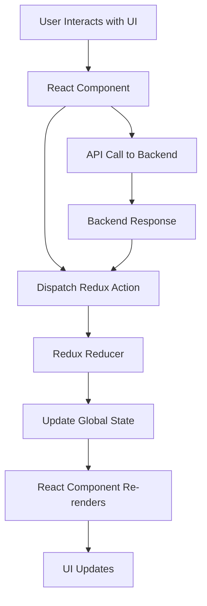

# Frontend Explanation & Workflow

## Tech Stack Used

- **React**: Main library for building the user interface as a Single Page Application (SPA).
- **Tailwind CSS**: Utility-first CSS framework for rapid and responsive UI design. Configured via `tailwind.config.js` and used throughout React components.
- **Redux**: State management library for handling global state such as authentication, user roles, and app data. Store and reducers are located in `src/Redux/`.
- **React Router**: Handles client-side routing and navigation between pages. Route protection logic is implemented in `src/routes/` (e.g., `TeacherRoute.jsx`, `PrivateRoutes.jsx`).

## Folder Structure & Usage

- `src/components/`: Reusable UI components, including teacher, admin, and user-specific components.
- `src/Pages/`: Page-level components for different views (Landing, Profile, Dashboard, etc.).
- `src/Redux/`: Redux store and reducers for managing state across the app.
- `src/routes/`: Route protection and navigation logic.
- `public/`: Static assets like images, icons, and manifest files.

## Workflow Overview

### 1. App Initialization

- The app starts from `src/index.js`, rendering `App.js`.
- Global styles are applied via Tailwind CSS (`index.css`, `App.css`).

### 2. Routing

- React Router manages navigation between pages.
- Protected routes (e.g., `TeacherRoute.jsx`) ensure only authorized users access certain pages.

### 3. State Management

- Redux manages authentication, user roles, and other global states.
- When a user logs in, their role (student, teacher, admin) is stored in Redux.

### 4. Role-Based Access

- Components and pages for teachers (in `TeacherComponents/`) are only accessible if the user is authenticated as a teacher.
- Route protection checks Redux state for user role before rendering teacher/admin/user-specific components.

### 5. UI Rendering

### 6. Data Flow

#### Data Flow Diagram

#### Data Flow Steps

1. **User Interacts with UI**: The user clicks a button, fills a form, or navigates a page.
2. **React Component**: The corresponding React component handles the event.
3. **Dispatch Redux Action**: The component dispatches an action to Redux (e.g., login, add course).
4. **API Call to Backend**: If needed, the action triggers an API call to the backend server.
5. **Backend Response**: The backend processes the request and sends a response.
6. **Redux Reducer**: The reducer updates the global state based on the action and/or backend response.
7. **Update Global State**: The Redux store is updated.
8. **React Component Re-renders**: Components subscribed to the relevant state re-render.
9. **UI Updates**: The user sees the updated UI (e.g., new course added, login success).

## Teacher Authorization & Access

- **Protection**: If a user is not authorized as a teacher, they are redirected or shown an error when trying to access teacher-only features.

- **Redux**: Managing global state, user roles, and authentication.
- **React Router**: Navigating between pages and protecting routes.

This setup ensures a modern, scalable, and secure frontend for the E-learning platform, with clear separation of concerns and robust role-based access control.
