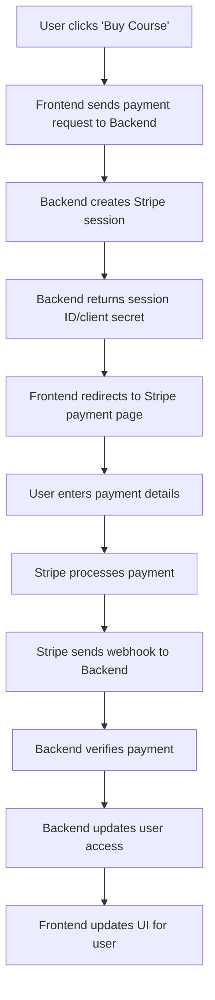

# E-learning Platform Interview Q&A

## 1. Can you walk me through the overall architecture of your e-learning platform? How did you decide on the folder structure and separation of concerns?
**Answer:**  
The platform uses the MERN stack: MongoDB, Express.js, React, and Node.js. The backend and frontend are separated into distinct folders. The backend contains models, routes, middlewares, and configuration files, while the frontend is organized by components, pages, Redux state management, and assets. This separation ensures modularity and maintainability.

## 2. How does user authentication and authorization work in your application? What security measures have you implemented?
**Answer:**  
Authentication is handled using JWT tokens. Middleware checks for valid tokens and user roles (Admin, Teacher, User) before granting access to protected routes. Passwords are hashed before storage, and sensitive endpoints are protected against unauthorized access.

## 3. Describe how you manage state in your frontend. Why did you choose Redux, and how do you handle asynchronous actions?
**Answer:**  
Redux is used for global state management, especially for user authentication, course data, and UI themes. Asynchronous actions are managed using Redux Thunk, allowing API calls and state updates in a predictable manner.

## 4. How do you handle video uploads and streaming in your platform? What challenges did you face with large files?
**Answer:**  
Videos are uploaded via the backend, stored securely, and streamed to users using efficient endpoints. Handling large files required optimizing upload limits, chunking, and ensuring smooth playback without overloading the server.

## 5. Explain how you implemented role-based access for Admin, Teacher, and User. How do you restrict access to certain routes or features?
**Answer:**  
Role-based access is enforced using middleware that checks the user's role from their JWT token. Frontend routes are also protected using custom route components that redirect unauthorized users.

## 6. What strategies did you use to optimize performance for both backend and frontend?
**Answer:**  
Backend optimizations include efficient database queries, caching, and pagination. Frontend optimizations involve code splitting, lazy loading components, and minimizing bundle size.

## 7. How do you handle error handling and logging in your backend APIs?
**Answer:**  
Errors are caught using Express middleware and returned with meaningful messages. Logging is implemented for critical actions and errors to help with debugging and monitoring.

## 8. Can you describe how you structured your database models for courses, users, and videos? What were some key design decisions?
**Answer:**  
Each model is defined in its own file, with clear relationships (e.g., courses reference videos and users). Schemas are designed to be flexible for future features, such as adding course categories or video metadata.

## 9. How do you ensure scalability and maintainability in your codebase?
**Answer:**  
Code is modular, with reusable components and clear separation of concerns. The use of environment variables and configuration files makes it easy to scale and maintain.

## 10. What testing strategies did you use for both frontend and backend? Can you show an example of a test case?
**Answer:**  
Frontend uses Jest and React Testing Library for component and integration tests. Backend uses Mocha/Chai for API endpoint testing. Example: Testing user login with valid and invalid credentials.

## 11. How do you manage deployment and environment configuration (e.g., with Vercel)?
**Answer:**  
Deployment is automated using Vercel for the frontend and backend. Environment variables are used for sensitive data, and configuration files are separated for development and production.

## 12. How do you handle payments and what security considerations did you take into account?
**Answer:**  
Payments are integrated using secure APIs (e.g., Stripe). Sensitive payment data is never stored on our servers, and all transactions are handled over HTTPS.

## 13. Can you discuss a specific feature you found challenging to implement and how you solved it?
**Answer:**  
Implementing video streaming with access control was challenging. I solved it by using signed URLs and backend checks to ensure only authorized users could access video content.

## 14. How do you handle real-time updates or notifications in your platform?
**Answer:**  
Real-time updates are handled using WebSockets for notifications, such as course updates or new messages. This ensures users receive timely information.

## 15. If you were to add a new feature, such as live classes, how would you approach the design and integration?
**Answer:**  
I would start by designing the database schema for live sessions, integrate a real-time video API (like WebRTC), and update both backend and frontend to support scheduling, joining, and managing live classes.


# Payment Integration in E-learning Platform

## Overview
This platform uses Stripe for secure payment processing. The integration ensures users can purchase courses or subscriptions safely and efficiently.

## Payment Flow

1. **Frontend Initiation**
   - User clicks a payment button (e.g., "Buy Course") in the React frontend.
   - The frontend sends a request to the backend to start a payment session.

2. **Backend Session Creation**
   - The Node.js/Express backend receives the request.
   - It uses the Stripe API to create a payment session (Stripe Checkout or PaymentIntent).
   - The backend returns the session ID or client secret to the frontend.

3. **Redirect to Stripe**
   - The frontend uses Stripe's JavaScript SDK to redirect the user to Stripe's secure payment page or displays a payment form.

4. **Payment Processing**
   - The user enters payment details on Stripe's secure page.
   - Stripe handles authentication, processing, and security.

5. **Webhook Handling**
   - After payment, Stripe sends a webhook to the backend to confirm the transaction.
   - The backend verifies the payment and updates the user's access (e.g., unlocks the purchased course).

6. **Frontend Update**
   - The frontend receives confirmation and updates the UI, showing the user their new access or purchase status.

## Technologies Used
- **Stripe:** Payment processing, secure checkout, webhooks.
- **React:** UI and Stripe SDK integration.
- **Node.js/Express:** Backend API endpoints and webhook handling.
- **MongoDB:** Storing user purchases and access rights.


## Payment Flow Diagram



 ## Application Flow Diagram

```mermaid
flowchart TD
    subgraph Frontend [Frontend (React)]
        A1[User interacts with UI]
        A2[User submits login/signup form]
        A3[User requests course/video/payment]
    end

    subgraph Backend [Backend (Node.js/Express)]
        B1[API Route receives request]
        B2[Controller processes request]
        B3[Model interacts with MongoDB]
        B4[JWT Token generated (on login/signup)]
        B5[Middleware validates JWT & roles]
        B6[Stripe Payment Session created]
        B7[Webhook endpoint receives Stripe event]
    end

    subgraph Database [MongoDB]
        C1[User Data]
        C2[Course Data]
        C3[Video Data]
        C4[Purchase Records]
    end

    subgraph Stripe [Stripe]
        D1[Payment Page]
        D2[Payment Processing]
        D3[Webhook Notification]
    end

    %% Flow
    A1 --> A2
    A2 --> B1
    B1 --> B2
    B2 --> B3
    B2 --> B4
    B4 --> A1
    A3 --> B1
    B1 --> B5
    B5 --> B2
    B2 --> B3
    B3 --> C1
    B3 --> C2
    B3 --> C3
    B3 --> C4
    A3 --> B6
    B6 --> D1
    D1 --> D2
    D2 --> D3
    D3 --> B7
    B7 --> B3
    B7 --> A1
```