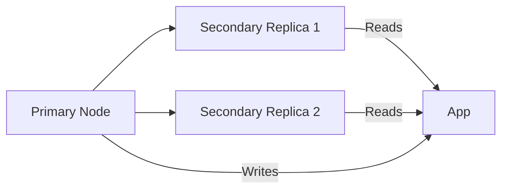
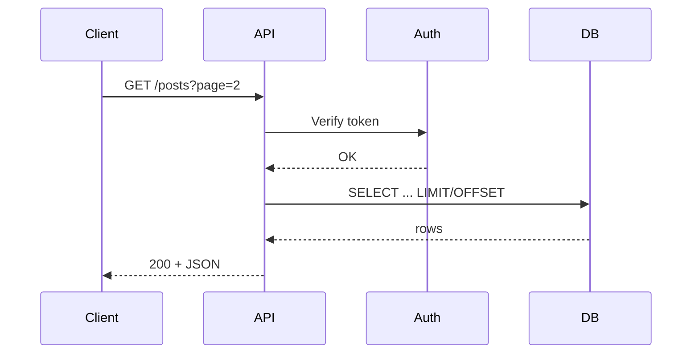
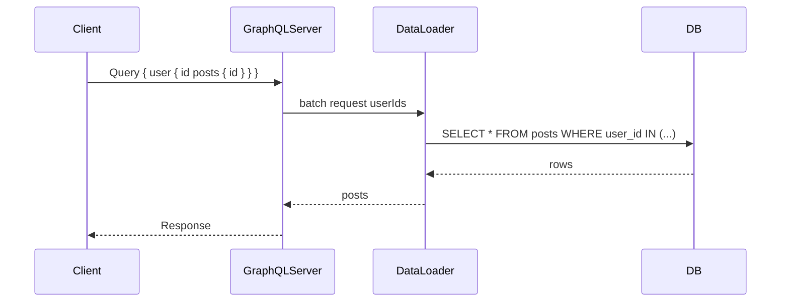
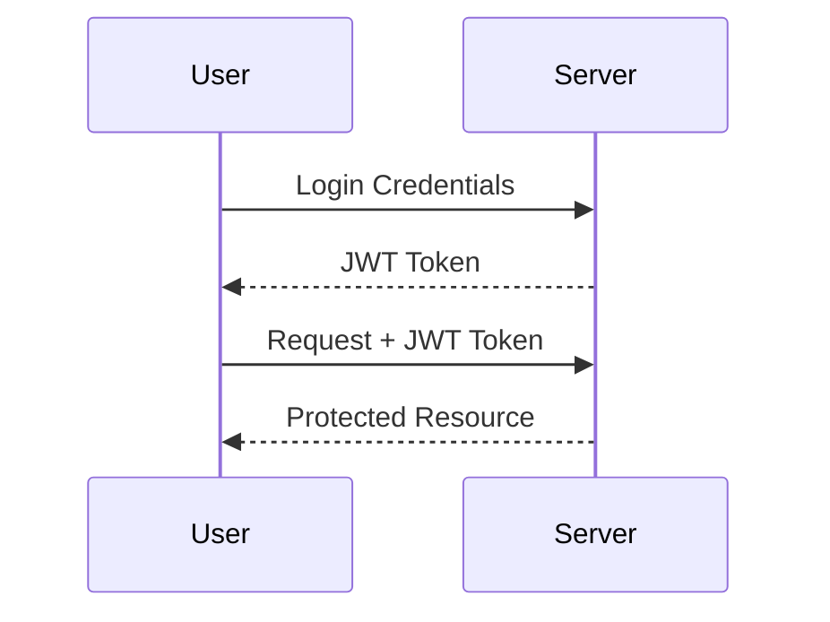
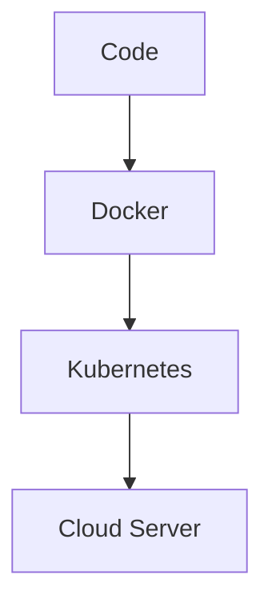
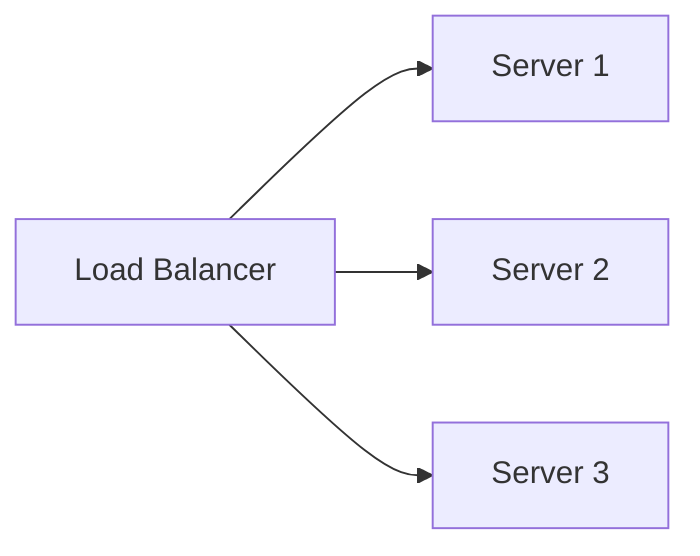

---

# Backend Web Development – Interview Notes

These notes cover **backend concepts, definitions, diagrams, and key interview points**.  
They are structured for **quick revision before technical interviews**.

---

## 1. **Backend (Definition)**
**Definition:** Backend is the **server-side** of a web application that processes business logic, stores data, handles security, and serves responses to client requests.

**Responsibilities:**
- Store, retrieve, and manipulate data.
- Implement business logic.
- Authenticate and authorize users.
- Communicate with frontend via APIs.

**Interview Tip:**  
Be ready to explain the difference between **frontend** and **backend** with examples.

---

## 2. **Client-Server Model**
**Definition:**  
A design pattern where the **client** (e.g., browser) requests data from the **server**, which processes and responds.

**Flow:**
1. Client sends an **HTTP/HTTPS request**.
2. Server processes request.
3. Server may interact with a **database**.
4. Response is sent back to the client.

```mermaid
sequenceDiagram
    participant Client
    participant Server
    participant Database

    Client->>Server: HTTP Request
    Server->>Database: Query Data
    Database-->>Server: Data Response
    Server-->>Client: HTTP Response (JSON/HTML)
````

**Interview Tip:**
Expect questions like:

* "Explain how the internet works when you type a URL." :: URL → DNS lookup → TCP + TLS → HTTP request → Server response → Browser renders → Page displayed
* "What is the difference between stateful and stateless communication?"

---

## 3. **Server-Side Languages**

**Definition:**
Programming languages used to write backend logic that runs on the server.

**Examples:**

| Language                   | Advantages                                 | Use Cases       |
| -------------------------- | ------------------------------------------ | --------------- |
| **Node.js (JavaScript)**   | Non-blocking I/O, great for real-time apps | Chat apps, APIs |
| **Python (Django, Flask)** | Easy syntax, huge library support          | AI, web APIs    |
| **Java (Spring Boot)**     | Strong typing, scalable                    | Enterprise apps |
| **PHP (Laravel)**          | Easy hosting, widely supported             | CMS, blogs      |
| **Ruby (Rails)**           | Rapid development                          | MVPs            |

**Interview Tip:**
You might be asked:

* "Why choose Node.js over Python for an API?"
* "What are the advantages of strongly typed languages?"

---

## 4. **Frameworks**

**Definition:**
Prebuilt collections of code and patterns that speed up backend development.

**Popular Frameworks:**

* **Express.js (Node.js)** – Minimal, fast, easy to learn.
* **Django (Python)** – Batteries included (ORM, auth).
* **Spring Boot (Java)** – Powerful, enterprise-ready.
* **Laravel (PHP)** – Elegant syntax, MVC structure.

**Interview Tip:**
Be ready to explain MVC (Model-View-Controller) architecture.

---

## Databases & APIs — Deep Dive (Interview-ready `.md`)

Below are **in-depth, interview-focused explanations** of **Databases (SQL & NoSQL)** and **APIs (REST & GraphQL)**. Each section includes definitions, internals, design patterns, common pitfalls, example queries/schemas, Mermaid diagrams, and interview tips / sample answers.

---

# 1. Databases — Overview (Definition & Purpose)

**Definition:** A database is a structured system to **store, retrieve, and manage data** for applications reliably and efficiently. Databases provide persistence, indexing, concurrency control, transactions, backup, and recovery.

**Why backend engineers must know them:** Data modeling, query performance, consistency, scaling and availability choices directly affect correctness, performance and cost of production systems.

---

# 2. SQL Databases (Relational DBs) — In-Depth

## 2.1 Definition & key properties

Relational databases store data in **tables (rows & columns)** and enforce a **schema** (types, constraints). They prioritize **ACID** guarantees (Atomicity, Consistency, Isolation, Durability) and rich query capabilities via **SQL**.

## 2.2 Core concepts

### Relational model

* **Tables** (relations), **rows** (tuples), **columns** (attributes).
* **Primary keys**, **foreign keys**, and **constraints** (NOT NULL, UNIQUE, CHECK).
* **Joins** combine rows from two or more tables based on keys.

### Schema design & normalization

* **Normalization goals:** remove redundancy, avoid anomalies.

  * 1NF: atomic values.
  * 2NF: remove partial dependency (for composite PKs).
  * 3NF: remove transitive dependency.
  * BCNF: stronger form of 3NF.
* **When to denormalize:** performance-critical read paths; document caching; OLAP. Denormalization trades storage & update complexity for read speed.

**Example normalized schema (users, posts, comments):**

```sql
CREATE TABLE users (
  id SERIAL PRIMARY KEY,
  username TEXT UNIQUE NOT NULL,
  email TEXT UNIQUE NOT NULL
);

CREATE TABLE posts (
  id SERIAL PRIMARY KEY,
  user_id INTEGER REFERENCES users(id),
  title TEXT,
  body TEXT,
  created_at TIMESTAMP DEFAULT now()
);

CREATE TABLE comments (
  id SERIAL PRIMARY KEY,
  post_id INTEGER REFERENCES posts(id),
  user_id INTEGER REFERENCES users(id),
  body TEXT,
  created_at TIMESTAMP DEFAULT now()
);
```

### Indexing

* **Purpose:** speed lookups, ORDER BY, JOINs.
* **Types:** B-tree (default), Hash (equal-only), GiST / GIN (full-text, arrays), BRIN (append-only large tables).
* **Composite indexes:** multi-column indexes (order matters).
* **Covering indexes:** index that includes all columns required by a query (index-only scans).
* **Trade-offs:** indexes speed reads but slow writes and increase storage.

**Common indexing pitfalls**

* Index on low-cardinality column (e.g., boolean) is often useless.
* Over-indexing harms insert/update throughput.
* Not using appropriate indexes for JOIN and WHERE leads to full table scans.

### Query optimization & EXPLAIN

* Use `EXPLAIN` / `EXPLAIN ANALYZE` to inspect query plans: sequential scan vs index scan, join algorithms (nested loop, hash, merge).
* Use proper statistics, `ANALYZE` to update planner stats.
* Avoid SELECT \* in large result sets; fetch only required columns.

### Transactions & Concurrency

* **ACID**:

  * **Atomicity:** all-or-nothing.
  * **Consistency:** DB constraints & triggers.
  * **Isolation:** how concurrent transactions see each other.
  * **Durability:** committed data persists.
* **Isolation levels** (SQL standard): Read Uncommitted, Read Committed, Repeatable Read, Serializable.

  * Lower levels allow more concurrency but expose anomalies (dirty reads, non-repeatable reads, phantom reads).
* **MVCC (Multi-Version Concurrency Control):** e.g., Postgres; readers don't block writers; versions used for snapshot isolation.
* **Locks:** table locks, row locks; deadlocks possible—DB detects and aborts one transaction.

### Partitioning & Sharding

* **Partitioning (within single DB instance):** split a table into partitions (range, list, hash) to manage very large tables and speed queries that filter on partition key.
* **Sharding (horizontal scaling):** split data across multiple DB instances (shards) by shard key. Requires application or middleware routing.
* **Replication:** primary/replica (master-slave), asynchronous or synchronous replication for HA and read scaling.

### High availability & backups

* **Failover:** automatic via replica promotion (election) or manual.
* **Backups:** logical backups (pg\_dump), physical (file-level snapshots), PITR (Point-in-time recovery) via WAL.
* **Disaster recovery planning**: RTO (recovery time objective), RPO (recovery point objective).

### Stored procedures, triggers, views

* **Stored procedures / functions**: put business logic in DB (cons: vendor lock-in; pros: can reduce round-trips).
* **Triggers:** run on data changes (use sparingly).
* **Materialized views:** cached result sets; refresh policies.

### ORMs (Object-Relational Mappers)

* **Pros:** speed development, map objects to rows.
* **Cons:** can generate inefficient SQL, hide expensive queries. Know how to read actual SQL generated and when to use raw queries.

### Connection pooling

* Use connection pools (PgBouncer) to avoid overhead & exhaustion of DB connections; pool sizing is critical (each DB connection uses memory).

## 2.3 SQL Example — join + explain (short)

```sql
-- Find all posts and author username
SELECT p.id, p.title, u.username
FROM posts p
JOIN users u ON p.user_id = u.id
WHERE p.created_at > '2025-01-01'
ORDER BY p.created_at DESC
LIMIT 20;
```

If slow: check indexes on `posts.created_at` and `posts.user_id`, and run `EXPLAIN ANALYZE` to locate bottleneck.

## 2.4 When to use SQL

* Strong consistency & complex transactions required (banking, payments).
* Complex ad-hoc queries and JOINs/aggregations.
* Mature tooling & analytics integration.

---

# 3. NoSQL Databases — In-Depth

## 3.1 Definition & motivation

NoSQL = “not only SQL”: databases that relax the relational model to achieve **scalability**, **flexible schema**, or specialized data models (documents, key-value pairs, wide-columns, graphs, time-series).

## 3.2 NoSQL categories & characteristics

### 1) Key–Value Stores

* Examples: Redis, Amazon DynamoDB (in key-value mode).
* Model: key → opaque value.
* Best for: sessions, caching, leaderboards.
* Fast, in-memory possibilities.

### 2) Document Databases

* Examples: MongoDB, Couchbase.
* Model: JSON-like documents (flexible schema).
* Patterns: embed vs reference.

  * **Embed** related data when read together and size limits allowed.
  * **Reference** (normalize across collections) when data is large or shared.
* Aggregation frameworks for complex queries.

**Example (MongoDB):**

```json
// posts collection
{
  "_id": ObjectId("..."),
  "title": "Hello",
  "body": "...",
  "author": { "id": 123, "username": "alice" },
  "comments": [
    { "user": "bob", "text": "nice!" }
  ]
}
```

### 3) Wide-Column Stores

* Examples: Cassandra, HBase.
* Model: tables with dynamic columns per row (good for sparse data).
* Strengths: massive write throughput, linear scalability.
* Consistency model: tunable (Cassandra: QUORUM, ONE, ALL).

### 4) Graph Databases

* Examples: Neo4j, Amazon Neptune.
* Model: nodes and relationships — optimized for graph traversals (social graphs, recommendations).
* Queries are traversals (fast for many hops).

### 5) Time-series / Specialized stores

* Examples: InfluxDB, TimescaleDB (Postgres extension).
* Optimized for time-series writes & retention policies.

## 3.3 CAP Theorem & consistency models

* **CAP:** In the presence of network partitions (P), you must choose between **Consistency (C)** and **Availability (A)**.

  * Systems choose trade-offs: Cassandra (AP by design; tunable), MongoDB typically CP (with wiredTiger + replica sets can favor consistency when configured).
* **Consistency models:** strong, eventual, causal, monotonic reads.
* **BASE:** Basically Available, Soft state, Eventual consistency — relaxed alternative to ACID for high-scale systems.

## 3.4 Data modeling patterns

* **Model around queries**: design schema for most frequent queries (denormalization common).
* **Embedding vs referencing** tradeoffs (consistency vs performance).
* **Pre-aggregate** heavy aggregations at write time if read performance critical.
* Use materialized views or secondary indexes where supported.

**Example — Users/Posts/Comments (document DB)**

* Option A: embed comments inside posts (good for few comments & frequent reads).
* Option B: store comments as separate collection referencing post\_id (good if comments numerous or need individual indexing).

## 3.5 Transactions & ACID in NoSQL

* Historically limited; modern NoSQL (MongoDB 4.x+, Redis Lua scripts, Cosmos DB) support multi-document transactions or transactional patterns.
* Typically single-document operations are atomic in many document DBs — design often relies on single-document atomicity.

## 3.6 Sharding, Replication & HA

* **Replication**: leader-follower replica sets, leaderless (gossip style), or multi-leader (conflict resolution).
* **Sharding**: automatic (MongoDB) or manual; choose shard key carefully to avoid hot shards.
* **Consensus algorithms:** Raft / Paxos used for leader election and consistent metadata (etcd, Mongo primary election).

## 3.7 Querying & Indexing

* Secondary indexes: supported in many NoSQL DBs but can be expensive on writes.
* Full-text search: specialized engines (Elasticsearch) or DB-provided features.
* Aggregation pipelines (MongoDB): map-reduce or pipeline stages for transformations.

## 3.8 Durability & Persistence (Redis)

* Redis offers different persistence modes:

  * RDB snapshots (point-in-time).
  * AOF (append-only log) for durability.
* Tradeoffs in latency vs durability.

## 3.9 When to use NoSQL

* Flexible or evolving schema (rapidly changing product data).
* High write throughput with horizontal scalability (telemetry, logs).
* Huge, distributed datasets requiring eventual consistency and geographic distribution.
* Specialized queries (graph traversals) that relational DBs don't perform well.

## 3.10 Example pitfalls

* Choosing bad shard key → unbalanced cluster and hot partitions.
* Embedding everything → document size limit exceeded (Mongo 16MB example).
* Over-indexing secondary indexes → write throughput collapse.
* Assuming strong consistency where DB provides eventual consistency.

## 3.11 Diagrams

### NoSQL Replication (replica set)



### Sharded cluster (simplified)

```mermaid
graph LR
  App --> Router[Query Router / Mongos]
  Router --> Shard1[Shard 1 (range hash)]
  Router --> Shard2[Shard 2]
  Router --> Config[Config Servers]
```

---

# 4. APIs (Application Programming Interfaces) — Deep Dive

**Definition:** An API defines how two systems communicate (requests/responses). For web backends, APIs expose endpoints/operations the frontend or other services call.

Two dominant patterns covered here: **REST** and **GraphQL**.

---

# 5. REST APIs — In-Depth

## 5.1 REST definition & constraints

**REST (Representational State Transfer):** an architectural style with constraints:

* **Client–Server**
* **Stateless** (server does not store client session state between requests)
* **Cacheable**
* **Uniform interface** (resource identification via URI, representations)
* **Layered system**
* **Code-on-demand (optional)**

Note: Many “REST APIs” in industry implement only parts of the REST constraints.

## 5.2 Resources & URI design

* Use **nouns** for resources: `/users`, `/users/123/posts`.
* Pluralize resource names consistently.
* Avoid verbs in URIs; use HTTP methods instead.

## 5.3 HTTP methods semantics (and idempotency)

* **GET** — retrieve resource (safe, idempotent).
* **POST** — create resource (not idempotent by default).
* **PUT** — replace/put resource at URI (idempotent).
* **PATCH** — apply partial modifications (not necessarily idempotent).
* **DELETE** — delete resource (idempotent; repeated DELETE same effect).

**Idempotency**: A request is idempotent if repeating it has the same effect as doing it once. (Important for retries, safe network retries.)

## 5.4 HTTP status codes — common mapping

* `200 OK` — success with body
* `201 Created` — resource created (include `Location` header)
* `204 No Content` — success with no body (e.g., DELETE)
* `400 Bad Request` — malformed request
* `401 Unauthorized` — not authenticated
* `403 Forbidden` — authenticated but not allowed
* `404 Not Found` — resource missing
* `409 Conflict` — conflict e.g., duplicate
* `422 Unprocessable Entity` — semantically invalid payload
* `429 Too Many Requests` — rate limit exceeded
* `5xx` — server errors

## 5.5 Headers & caching

* `Content-Type` / `Accept` for content negotiation (JSON, XML).
* Caching: `Cache-Control`, `ETag`, `Last-Modified`, `Expires`.
* Conditional requests: use `If-None-Match` with `ETag` to avoid sending unchanged resources.

## 5.6 Versioning strategies

* URI versioning: `/v1/users` (explicit, easy).
* Header versioning: `Accept: application/vnd.myapi.v1+json`.
* Query param: `?v=1`.
* Choose consistent approach and document it.

## 5.7 Pagination, filtering, sorting

* **Pagination styles**:

  * `limit` / `offset` (simple, problems at high offsets).
  * Cursor-based / keyset pagination (better for large result sets).
* Provide consistent filter param conventions: e.g., `?sort=-created_at&status=active`.

## 5.8 Rate limiting & throttling

* Protect APIs: quotas per IP / per API key.
* Use 429 responses with `Retry-After` header.

## 5.9 Security

* **TLS (HTTPS)** mandatory for protecting data in transit.
* **Authentication**: API Keys, HTTP Basic (rare), OAuth2, JWT Bearer tokens.
* **Authorization**: Role-based access control (RBAC), attribute-based (ABAC).
* **CSRF** protections (for cookie-based auth).
* **CORS** configuration for cross-origin requests.
* **Input validation & output encoding** to prevent injection/XSS.

## 5.10 Idempotency keys

* For non-idempotent endpoints (POST payments), accept client idempotency key (e.g., `Idempotency-Key`) to ensure retries do not double-charge.

## 5.11 Hypermedia (HATEOAS)

* Hypermedia as the engine of application state—responses include links (`_links`) so clients can discover actions. In practice, often not fully implemented.

## 5.12 Monitoring, docs & testing

* **Swagger / OpenAPI** for docs and contract-first design.
* **Contract testing** (Pact) for consumer-provider compatibility.
* Use standardized error response format (status, code, message, details).

## 5.13 Example REST endpoint (Express)

```js
// GET /users/:id
app.get('/users/:id', async (req, res) => {
  const user = await db.query('SELECT id, username FROM users WHERE id=$1', [req.params.id]);
  if (!user) return res.status(404).json({ error: 'Not found' });
  res.json(user);
});
```

## 5.14 Performance & caching strategies

* Use HTTP caching headers and CDNs for public resources.
* Internally use caches (Redis) for expensive queries.
* Apply compression (gzip, brotli), HTTP/2 to reduce latency.

## 5.15 REST Interview Tips & common questions

* Q: “Explain idempotency and why it matters.” — A: show definition, give examples (GET idempotent, POST usually not), explain retry semantics and idempotency-key.
* Q: “How to implement pagination?” — A: pros/cons of offset vs cursor; example queries.
* Q: “How to secure REST APIs?” — A: TLS, auth (JWT/OAuth2), input validation, rate-limiting, logging.

**Mermaid — REST request flow**



---

# 6. GraphQL — In-Depth

## 6.1 What is GraphQL?

GraphQL is a query language and runtime that lets clients ask exactly for the data they need. The server exposes a **schema** describing types and fields; clients query against that schema.

## 6.2 Core concepts

* **Schema**: type definitions (`type User { id: ID!, name: String }`).
* **Query**: read operations.
* **Mutation**: write operations (state change).
* **Subscription**: real-time updates (WebSocket).
* **Resolver**: function to fetch data for each field.

**Example schema and query**

```graphql
type User {
  id: ID!
  name: String!
  posts: [Post!]!
}

type Post {
  id: ID!
  title: String!
  author: User!
}

type Query {
  user(id: ID!): User
  posts(limit: Int): [Post!]!
}

# Client query
query {
  user(id: "123") {
    name
    posts {
      title
    }
  }
}
```

## 6.3 Advantages

* **No over-fetching or under-fetching**: client specifies exactly required fields.
* Single endpoint (simplifies networking & versioning).
* Strongly typed schema + introspection (self-documenting).

## 6.4 Common problems & mitigations

### N+1 problem

* Occurs when resolving nested fields triggers repeated DB queries per parent row.
* **Mitigation:** Use batching & caching layers (e.g., DataLoader) to batch DB calls.

### Query complexity & DoS

* GraphQL queries can be arbitrarily deep/expensive.
* **Mitigations:** query depth limits, cost analysis, query whitelisting/persisted queries.

### Caching

* Harder than REST because responses vary based on query shape.
* Techniques: per-field caching, persisted queries, CDN caching for normalized responses (Apollo Engine & persisted query artifacts).

### Authorization

* Field-level authorization: check permissions inside resolvers.
* RLS-like patterns: pass user context and enforce at resolver/data-source level.

## 6.5 Schema design patterns

* **Normalize types** and reuse types across queries.
* **Stitching/Federation**: stitch multiple GraphQL services into one federated schema (Apollo Federation) for microservices.

## 6.6 Subscriptions

* Use WebSockets or server-sent events for real-time updates.
* Consider scaling strategy (pub/sub backend like Redis or Kafka).

## 6.7 Caching & Persisted Queries

* Persisted queries avoid sending long queries repeatedly.
* Use CDN and edge caching for persisted query responses.

## 6.8 Example resolver (Node & DataLoader)

```js
const DataLoader = require('dataloader');
const postLoader = new DataLoader(ids => db.getPostsByUserIds(ids));

const resolvers = {
  User: {
    posts: (user) => postLoader.load(user.id)
  }
};
```

## 6.9 GraphQL Interview Tips & common questions

* Q: “Explain N+1 problem and solution.” — A: describe how each parent triggers child query; introduce DataLoader and batching.
* Q: “When to use GraphQL over REST?” — A: many clients with variable data needs / mobile apps; single endpoint; complex joins across domains.
* Q: “How to secure GraphQL?” — A: depth limiting, query cost, auth in context, field-level checks, rate-limits.

**Mermaid — GraphQL request/resolver flow**



---

# 7. REST vs GraphQL — Quick Comparison (Interview Quickfire)

| Aspect      | REST                                               | GraphQL                                             |
| ----------- | -------------------------------------------------- | --------------------------------------------------- |
| Endpoint(s) | Many (resource URIs)                               | Single endpoint                                     |
| Fetching    | Fixed responses per endpoint → may over/underfetch | Client requests exact fields                        |
| Versioning  | Often needed (`/v1/`)                              | Schema evolution (add fields) avoids versions often |
| Caching     | HTTP/CDN-friendly                                  | Harder; needs layer-level caching                   |
| Complexity  | Simpler to implement                               | More runtime complexity & tooling                   |
| Use cases   | Simple CRUD, public APIs, cache-heavy              | Mobile apps, many clients, complex aggregated data  |

**Interview tip:** Pick one and justify with concrete trade-offs for a given product scenario.

---

# 8. Practical examples: modeling same domain in SQL & MongoDB

## SQL (normalized)

* Good for complex queries and transactions.

```sql
-- get posts with author name (one SQL query + join)
SELECT p.id, p.title, u.username
FROM posts p
JOIN users u ON p.user_id = u.id
WHERE p.created_at > ...
```

## MongoDB (document)

* Embed author snapshot in posts (denormalized) to avoid join-like lookups:

```json
{
  "_id": "...",
  "title": "Post",
  "author": { "id": "u1", "username": "alice" },
  "comments": [ ... ]
}
```

* Single read returns post + author fields; updates to author username require updating many posts unless referencing.

---

# 9. Common Interview Questions (with short sample answers)

**Q:** Difference between SQL and NoSQL?
**A:** SQL = structured schema, strong ACID transactions, joins; best for complex transactions. NoSQL = flexible schema, horizontal scale, eventual consistency in many systems, optimized for specific models like documents or wide columns. Choose based on data access patterns.

**Q:** What is a transaction isolation level?
**A:** It defines visibility of other transactions' changes. From weakest to strongest: Read Uncommitted → Read Committed (no dirty reads) → Repeatable Read (no non-repeatable reads) → Serializable (full serializability). Stronger isolation reduces concurrency.

**Q:** Explain CAP theorem.
**A:** In presence of network partitions (P), you can have either Consistency (all nodes see same data) or Availability (system responds), but not both. Partition tolerance is required in distributed systems, so trade is between C and A.

**Q:** How to fix N+1 problem in GraphQL?
**A:** Use batching and caching utilities like DataLoader to batch DB requests by key and cache results within request lifecycle.

**Q:** When to use GraphQL vs REST?
**A:** GraphQL is good when clients need flexible, exact fields and you want a single evolving endpoint; REST is simpler, benefits from HTTP caching, better when endpoints map naturally to resources.

**Q:** How to choose a shard key?
**A:** Pick a field with even distribution across dataset and queries that you will use to route requests; avoid monotonically increasing keys (time-based) to prevent hot shards.

**Q:** How to secure a public API?
**A:** Use HTTPS, authenticate requests (OAuth2/JWT), validate inputs, rate-limit, monitor, use proper CORS policy and audit logging.

---

# 10. Short Cheat Sheet / Memory Joggers

* **ACID vs BASE:** ACID = strict correctness; BASE = availability & eventual consistency.
* **Indexes** speed reads but slow writes — measure and prune.
* **EXPLAIN** is your friend — always examine slow queries.
* **Embed vs Reference (NoSQL):** embed for locality & read speed; reference when data shared/large.
* **Idempotency:** essential for safe retries (use keys for POST).
* **Transaction isolation:** stronger = safer but less concurrent.
* **N+1 problem:** watch nested resolver DB calls — use batching.
* **Sharding:** choose balanced shard key; plan for re-sharding complexity.
* **Caching:** ETag + Cache-Control for REST; field-level or persisted queries for GraphQL.
* **Monitoring:** always have metrics, slow query logs, and alerting.

---

# 11. Useful sample snippets (quick references)

### SQL — create index & explain

```sql
CREATE INDEX idx_posts_user_created ON posts (user_id, created_at DESC);
EXPLAIN ANALYZE
SELECT p.* FROM posts p WHERE user_id=123 ORDER BY created_at DESC LIMIT 10;
```

### MongoDB — embed vs reference (insert)

```js
// embed comments
db.posts.insertOne({ title: "X", author: { id: 1, name: "a" }, comments: [{user:"b", text:"ok"}] });

// reference comments
db.comments.insertOne({ post_id: ObjectId("..."), user: "b", text: "ok" });
```

### GraphQL — query & mutation

```graphql
query GetUserWithPosts {
  user(id: "1") {
    id
    name
    posts { id title }
  }
}

mutation CreatePost {
  createPost(input: { title: "Hi", body: "..." }) {
    id
    title
  }
}

```

## 7. **Authentication & Authorization**

**Definitions:**

* **Authentication** → Verifying identity (login).
* **Authorization** → Verifying permissions (what you can do).

**Methods:**

* Session-based
* Token-based (JWT)
* OAuth2 (Google, Facebook login)



**Interview Tip:**
Be ready to explain JWT and its security benefits.

---

## 8. **Middleware**

**Definition:**
Functions that run **before** the final request handler.

**Uses:**

* Logging
* Authentication checks
* Parsing request bodies

Example:

```javascript
app.use((req, res, next) => {
    console.log(req.method, req.url);
    next();
});
```

**Interview Tip:**
Possible question:

* "What is middleware in Express.js and why is it used?"

---

## 9. **Caching**

**Definition:**
Storing frequently accessed data in memory for faster access.

**Tools:**

* Redis
* Memcached

**Benefits:**

* Reduces DB load.
* Improves performance.

**Interview Tip:**
Expect: "How would you implement caching for an API?"

---

## 10. **Deployment**

**Definition:**
Making your backend available to users.

### Methods:

* **Servers**: AWS EC2, Azure VM.
* **Containerization**: Docker (packages app + dependencies).
* **Orchestration**: Kubernetes.



**Interview Tip:**
Possible question:

* "Difference between a VM and a container?"

---

## 11. **Security Best Practices**

**Definition:**
Techniques to protect applications from threats.

* Validate user input.
* Use HTTPS.
* Hash + salt passwords.
* Prevent:

  * SQL Injection
  * XSS
  * CSRF

**Interview Tip:**
Expect:

* "How do you prevent SQL Injection?"
* "Why use bcrypt for password hashing?"

---

## 12. **Scaling**

**Definition:**
Expanding system capacity.

* **Vertical Scaling** → Add CPU/RAM.
* **Horizontal Scaling** → Add more servers.
* **Load Balancing** → Evenly distribute traffic.



**Interview Tip:**
You might get:

* "Explain horizontal vs vertical scaling with examples."

---

## 13. **Logging & Monitoring**

**Definition:**
Tracking application performance and errors.

* **Logging Tools**: Winston, Log4j.
* **Monitoring Tools**: Prometheus, Grafana.

**Interview Tip:**
Expect: "How would you debug an API in production?"

---

## 14. **Message Queues**

**Definition:**
Asynchronous communication between services.

**Examples:**

* RabbitMQ
* Kafka
* AWS SQS

**Use Case:**
Send email after purchase without slowing down main request.

**Interview Tip:**
Expect:

* "Why use a message queue?"
* "Difference between RabbitMQ and Kafka?"

---

## 15. **Testing**

**Definition:**
Process of ensuring backend works correctly.

* **Unit Tests** → Test individual functions.
* **Integration Tests** → Test modules together.
* **Load Tests** → Test performance.

**Interview Tip:**
Possible: "How do you test an API before deployment?"

---


