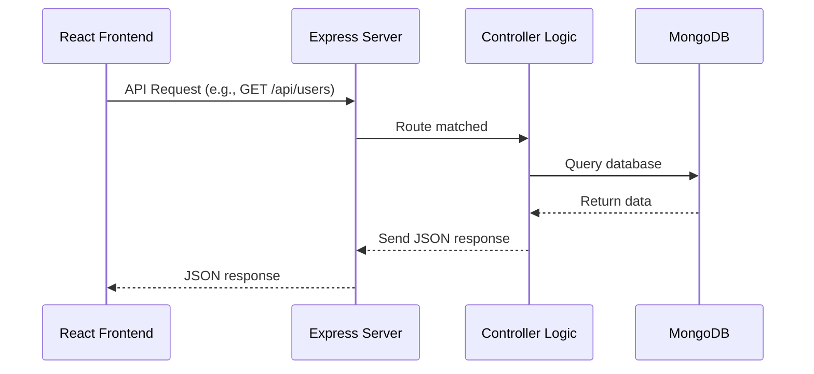
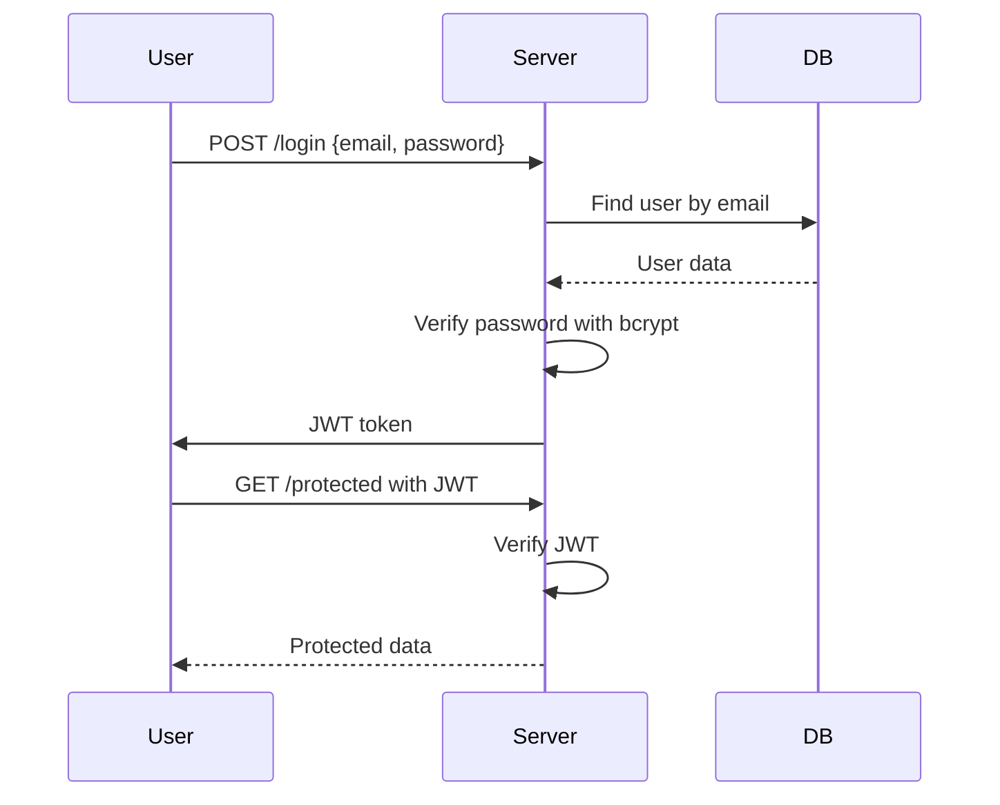
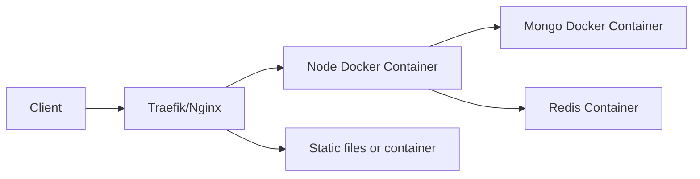
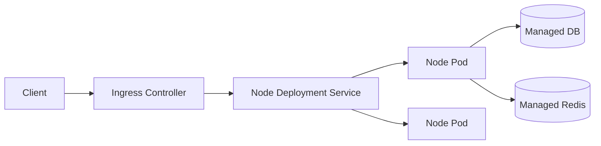

---

# MERN Backend Development – Complete Notes

MERN = **MongoDB**, **Express.js**, **React.js**, **Node.js**  
We’ll focus here on the **backend** part (Node.js + Express.js + MongoDB).

---

## 1. Overview of MERN Backend
**Definition:**  
The backend of a MERN application is built with **Node.js** (runtime) and **Express.js** (framework) to handle server-side logic, APIs, authentication, and database communication with **MongoDB**.

**Core Responsibilities:**
- Receive HTTP requests from frontend (React.js).
- Process business logic.
- Interact with MongoDB for data storage/retrieval.
- Send responses (JSON) back to frontend.

---

## 2. MERN Backend Architecture Flow

```mermaid
flowchart LR
    A[React Frontend] -->|HTTP Request| B[Express.js Server]
    B -->|Business Logic| C[Node.js Runtime]
    C -->|Query| D[(MongoDB Database)]
    D -->|Data Response| C
    C -->|JSON Response| A
````

**Flow:**

1. React frontend sends API requests.
2. Express routes the request to the correct controller.
3. Node.js executes logic (validation, authentication, queries).
4. MongoDB stores/retrieves data.
5. Response sent back to React as JSON.

---

## 3. Key Components of MERN Backend

### 3.1 **Node.js**

* **Definition:** JavaScript runtime built on Chrome’s V8 engine.
* **Why in MERN?** Lets you use JS for both frontend & backend.
* **Features:** Non-blocking I/O, event-driven, scalable.

Example:

```javascript
const http = require('http');
http.createServer((req, res) => {
  res.end('Hello MERN Backend');
}).listen(3000);
```

---

### 3.2 **Express.js**

* **Definition:** Minimal, fast Node.js framework for building APIs.
* **Features:**

  * Routing
  * Middleware
  * Error handling
  * REST API support

Example route:

```javascript
const express = require('express');
const app = express();

app.get('/api/users', (req, res) => {
  res.json({ message: 'Users list' });
});

app.listen(5000, () => console.log('Server running'));
```

---

### 3.3 **MongoDB**

* **Definition:** NoSQL document-oriented database.
* **Why in MERN?** Flexible schema, stores JSON-like documents.
* **Features:** High performance, horizontal scaling.

Example:

```javascript
db.users.insertOne({ name: "John", age: 25 });
```

---

### 3.4 **Mongoose (ODM)**

* **Definition:** Object Data Modeling library for MongoDB in Node.js.
* **Features:**

  * Schema definitions
  * Data validation
  * Query building

Example:

```javascript
const mongoose = require('mongoose');
const userSchema = new mongoose.Schema({ name: String, age: Number });
const User = mongoose.model('User', userSchema);
```

---

### 3.5 **Middleware**

* **Definition:** Functions that run between request and response.
* **Examples:**

  * Body parser
  * Authentication check
  * Logging

Example in Express:

```javascript
app.use((req, res, next) => {
  console.log(req.method, req.url);
  next();
});
```

---

## 4. Typical MERN Backend Request Flow



---

## 5. Common MERN Backend Features

* **Authentication** (JWT, bcrypt for hashing passwords)
* **CRUD APIs** (Create, Read, Update, Delete)
* **Validation** (Joi, express-validator)
* **Error Handling** (custom middleware)
* **Security** (helmet, rate limiting, CORS)
* **File Uploads** (multer)
* **Environment Config** (.env files)

---

## 6. Example MERN Backend API Structure

```
project/
├── config/       # DB config
├── controllers/  # Business logic
├── models/       # Mongoose schemas
├── routes/       # API endpoints
├── middleware/   # Auth, logging
├── server.js     # Entry point
```

Example route:

```javascript
// routes/userRoutes.js
const express = require('express');
const { getUsers } = require('../controllers/userController');
const router = express.Router();

router.get('/', getUsers);

module.exports = router;
```

---

## 7. MERN Backend Interview Questions & Answers

### Q1: Explain the role of Node.js in MERN stack.

**A:**
Node.js is the runtime environment that executes JavaScript code on the server side. It provides event-driven, non-blocking I/O for handling many requests efficiently.

---

### Q2: How does Express.js handle routing?

**A:**
Express uses methods like `.get()`, `.post()`, `.put()`, `.delete()` to define routes. Routes map HTTP requests to controller functions.

---

### Q3: Why use MongoDB for MERN?

**A:**
MongoDB stores data as BSON (binary JSON), making it a natural fit with JavaScript objects from Node.js/Express.

---

### Q4: Difference between SQL and NoSQL in MERN context?

**A:**
SQL is relational with fixed schema; NoSQL (MongoDB) is document-oriented and schema-flexible, ideal for agile development.

---

### Q5: How is authentication implemented in MERN backend?

**A:**
Usually with:

* **JWT**: JSON Web Tokens for stateless authentication.
* **bcrypt**: For password hashing.

Flow:

1. User logs in → server validates credentials.
2. Server generates JWT → sends to client.
3. Client includes JWT in request headers.

---

### Q6: What is middleware in Express.js?

**A:**
Middleware is a function with `(req, res, next)` parameters that runs before the final route handler. Used for authentication, logging, validation, etc.

---

### Q7: How do you connect MongoDB in MERN?

**A:**
With Mongoose:

```javascript
mongoose.connect(process.env.MONGO_URI)
  .then(() => console.log('DB Connected'))
  .catch(err => console.error(err));
```

---

### Q8: How does the request-response cycle work in MERN?

**A:**
React sends an API request → Express routes it → Controller executes logic → MongoDB queried → Response sent as JSON.

---

### Q9: How to handle errors in MERN backend?

**A:**
By creating error-handling middleware:

```javascript
app.use((err, req, res, next) => {
  res.status(err.status || 500).json({ message: err.message });
});
```

---

### Q10: What security best practices do you follow in MERN backend?

**A:**

* Use HTTPS.
* Validate input.
* Sanitize data.
* Use helmet for headers.
* Rate limiting.
* JWT expiry.

---

## 8. Sample MERN Backend Authentication Flow




# MERN Backend Crash Course — Interview-ready `.md`

Comprehensive, interview-focused MERN backend guide: **deep explanations**, **code snippets** (CRUD, auth, file upload), **Mermaid flow/architecture diagrams**, **deployment patterns**, **best practices**, and **40+ MERN backend interview Q\&A with model answers**. Save as `mern-backend-notes.md`.

---

# Table of Contents

1. Overview (MERN backend)
2. Project skeleton & conventions
3. CRUD API (code)
4. Authentication & Authorization (JWT, bcrypt)
5. Validation & Error Handling
6. File Uploads (Multer)
7. Mongoose models & data modeling patterns
8. Pagination, Filtering, Sorting
9. Caching & performance
10. Security & best practices
11. Logging, monitoring, testing
12. Deployment patterns (diagrams & steps)
13. Scaling, availability & backups
14. Common pitfalls & optimizations
15. 40+ MERN Backend Interview Questions & Answers

---

# 1. Overview (MERN backend)

**MERN** = MongoDB (DB) + Express (HTTP framework) + React (frontend) + Node.js (runtime).
This file focuses on **backend**: Node + Express + Mongoose + MongoDB. The backend provides REST/GraphQL APIs consumed by React (or other clients), handles authentication, data validation, business logic, and integrations.

**Key ideas:**

* Use **JSON** over HTTP.
* Keep server **stateless** where possible (JWT), or use sessions for server-side state.
* Model data according to access patterns — for MongoDB design for reads (embed vs reference).
* Secure endpoints, validate inputs, and log important events.

---

# 2. Project skeleton & conventions

```
my-mern-app/
├── package.json
├── server.js             # entrypoint
├── config/
│   └── db.js
├── controllers/
│   └── userController.js
├── models/
│   └── User.js
├── routes/
│   └── userRoutes.js
├── middleware/
│   ├── auth.js
│   ├── errorHandler.js
│   └── validate.js
├── utils/
│   └── logger.js
├── tests/
├── uploads/
├── .env
└── Dockerfile
```

**Conventions**

* Use environment variables for secrets (`process.env.*`).
* Keep controllers thin — only orchestrate services and respond.
* Business logic can live in services layer if complex.
* Use consistent error response shape:

```json
{ "status": "error", "message": "Description", "code": "USER_NOT_FOUND", "details": {} }
```

---

# 3. CRUD API — Minimal working example

Below is a concise but complete example illustrating routes, controllers, and Mongoose model for a `User` resource.

```js
// server.js
require('dotenv').config();
const express = require('express');
const mongoose = require('mongoose');
const userRoutes = require('./routes/userRoutes');
const errorHandler = require('./middleware/errorHandler');

const app = express();
app.use(express.json());
app.use('/api/users', userRoutes);
app.use(errorHandler);

mongoose.connect(process.env.MONGO_URI)
  .then(() => app.listen(process.env.PORT || 5000, () => console.log('Server up')))
  .catch(err => console.error('DB connect error', err));
```

```js
// models/User.js
const mongoose = require('mongoose');

const userSchema = new mongoose.Schema({
  name: { type: String, required: true, trim: true },
  email: { type: String, required: true, unique: true, lowercase: true },
  passwordHash: { type: String, required: true },
  role: { type: String, enum: ['user','admin'], default: 'user' },
  createdAt: { type: Date, default: Date.now }
});

module.exports = mongoose.model('User', userSchema);
```

```js
// controllers/userController.js
const User = require('../models/User');

exports.createUser = async (req, res, next) => {
  try {
    const { name, email, passwordHash } = req.body;
    const user = await User.create({ name, email, passwordHash });
    res.status(201).json({ id: user._id, name: user.name, email: user.email });
  } catch (err) { next(err); }
};

exports.getUser = async (req, res, next) => {
  try {
    const user = await User.findById(req.params.id).select('-passwordHash');
    if (!user) return res.status(404).json({ message: 'Not found' });
    res.json(user);
  } catch (err) { next(err); }
};

exports.updateUser = async (req, res, next) => {
  try {
    const user = await User.findByIdAndUpdate(req.params.id, req.body, { new: true }).select('-passwordHash');
    if (!user) return res.status(404).json({ message: 'Not found' });
    res.json(user);
  } catch (err) { next(err); }
};

exports.deleteUser = async (req, res, next) => {
  try {
    await User.findByIdAndDelete(req.params.id);
    res.status(204).end();
  } catch (err) { next(err); }
};
```

```js
// routes/userRoutes.js
const express = require('express');
const { createUser, getUser, updateUser, deleteUser } = require('../controllers/userController');
const router = express.Router();

router.post('/', createUser);
router.get('/:id', getUser);
router.put('/:id', updateUser);
router.delete('/:id', deleteUser);

module.exports = router;
```

**Notes:**

* Use `select('-passwordHash')` to avoid returning sensitive fields.
* Add validation (next section) before creating/updating users.

---

# 4. Authentication & Authorization

## 4.1 JWT + bcrypt flow (stateless)

* Register: hash password with `bcrypt` → store user with `passwordHash`.
* Login: compare password with stored `passwordHash` → issue signed JWT containing user id and roles.
* Protect routes: verify JWT on each request; attach `req.user`.

**Why JWT?**

* Stateless (no server memory). Scales horizontally.
* Tokens can carry claims (role, expiry).

**Why still be careful?**

* JWT revocation is non-trivial (use short token lifespan + refresh tokens or store blacklists).
* Never store secrets in token payload (sensitive data).

## 4.2 Example code

```js
// utils/auth.js
const jwt = require('jsonwebtoken');
const SECRET = process.env.JWT_SECRET;
const sign = (payload, expiresIn='1h') => jwt.sign(payload, SECRET, { expiresIn });
const verify = token => jwt.verify(token, SECRET);

module.exports = { sign, verify };
```

```js
// controllers/authController.js
const bcrypt = require('bcrypt');
const User = require('../models/User');
const { sign } = require('../utils/auth');

exports.register = async (req, res, next) => {
  try {
    const { name, email, password } = req.body;
    const salt = await bcrypt.genSalt(10);
    const passwordHash = await bcrypt.hash(password, salt);
    const user = await User.create({ name, email, passwordHash });
    res.status(201).json({ id: user._id, email: user.email });
  } catch (err) { next(err); }
};

exports.login = async (req, res, next) => {
  try {
    const { email, password } = req.body;
    const user = await User.findOne({ email });
    if (!user) return res.status(401).json({ message: 'Invalid credentials' });
    const ok = await bcrypt.compare(password, user.passwordHash);
    if (!ok) return res.status(401).json({ message: 'Invalid credentials' });
    const token = sign({ sub: user._id.toString(), role: user.role }, '2h');
    res.json({ token, expiresIn: 7200 });
  } catch (err) { next(err); }
};
```

```js
// middleware/auth.js
const { verify } = require('../utils/auth');

module.exports = (requiredRole) => (req, res, next) => {
  const auth = req.headers.authorization;
  if (!auth) return res.status(401).json({ message: 'Auth required' });
  const [, token] = auth.split(' ');
  try {
    const payload = verify(token);
    req.user = payload;
    if (requiredRole && payload.role !== requiredRole) return res.status(403).json({ message: 'Forbidden' });
    next();
  } catch (err) { res.status(401).json({ message: 'Invalid token' }); }
};
```

**Refresh tokens:** Implement refresh tokens stored securely (HTTP-only cookies or in DB), rotate them and revoke on logout.

---

# 5. Validation & Error Handling

## 5.1 Validation

Use `express-validator` or `Joi` to validate incoming payloads.

Example with `express-validator`:

```js
// routes/authRoutes.js
const { body } = require('express-validator');
const { register } = require('../controllers/authController');

router.post('/register', [
  body('email').isEmail(),
  body('password').isLength({ min: 8 })
], register);
```

Then in controller or middleware check `validationResult(req)` and return 422 with details.

## 5.2 Centralized error handler

```js
// middleware/errorHandler.js
module.exports = (err, req, res, next) => {
  console.error(err);
  const status = err.status || 500;
  res.status(status).json({
    status: 'error',
    message: err.message || 'Internal Server Error'
  });
};
```

**Best practice:** throw errors with `.status` and `.code` in service layer; handle them centrally.

---

# 6. File Uploads (Multer)

Use `multer` for handling `multipart/form-data`.

```js
// middleware/upload.js
const multer = require('multer');
const storage = multer.diskStorage({
  destination: (req, file, cb) => cb(null, 'uploads/'),
  filename: (req, file, cb) => cb(null, Date.now() + '-' + file.originalname)
});
const upload = multer({ storage, limits: { fileSize: 5 * 1024 * 1024 } });
module.exports = upload;
```

Route example:

```js
// routes/media.js
router.post('/avatar', upload.single('avatar'), (req, res) => {
  res.json({ filename: req.file.filename, path: `/uploads/${req.file.filename}` });
});
```

**Notes:**

* Prefer object storage (AWS S3) for production; upload directly to S3 via signed URLs when possible.
* Validate file types and sizes.

---

# 7. Mongoose models & data modeling patterns

## 7.1 Modeling choices — embed vs reference

**Embed** when:

* Data is always read together and size remains modest (e.g., address in user).

**Reference** when:

* Data is shared by many parents, large, updated frequently (e.g., user profile referenced by many posts).

## 7.2 Example: Posts & Comments

Embed comments for small, read-heavy workloads:

```js
const postSchema = new Schema({
  title: String,
  body: String,
  comments: [{ userId: Schema.Types.ObjectId, text: String, createdAt: Date }]
});
```

Reference for large comment volumes:

```js
const commentSchema = new Schema({
  postId: { type: Schema.Types.ObjectId, ref: 'Post' },
  userId: { type: Schema.Types.ObjectId, ref: 'User' },
  text: String
});
```

## 7.3 Indexing

```js
postSchema.index({ userId: 1, createdAt: -1 });
userSchema.index({ email: 1 }, { unique: true });
```

**Tip:** index fields used in filters, joins (`populate`) and sorts.

---

# 8. Pagination, Filtering, Sorting

## 8.1 Offset pagination (simple)

```js
const page = parseInt(req.query.page) || 1;
const limit = parseInt(req.query.limit) || 20;
const skip = (page - 1) * limit;
const posts = await Post.find().sort({ createdAt: -1 }).skip(skip).limit(limit);
```

**Con:** offset becomes slow at high offsets.

## 8.2 Cursor / Keyset pagination (recommended for scalability)

* Use `createdAt` + `_id` as cursor.

```js
const limit = 20;
const cursor = req.query.cursor; // encode as base64 of createdAt + _id
let q = {};
if (cursor) {
  const { createdAt, _id } = decode(cursor);
  q = { $or: [{ createdAt: { $lt: createdAt } }, { createdAt: createdAt, _id: { $lt: _id } }] };
}
const posts = await Post.find(q).sort({ createdAt: -1, _id: -1 }).limit(limit);
```

**Tip:** Return next cursor in response.

---

# 9. Caching & Performance

## 9.1 In-memory cache (Redis)

* Cache expensive DB results or sessions.
* Use TTLs and cache invalidation strategies (write-through, write-back, cache-aside).

## 9.2 Query optimization

* Use `explain()` in mongo shell to analyze queries.
* Project fields (`.select('a b')`) instead of returning full documents.
* Use indexes and avoid regex scans without anchors.

## 9.3 Pagination & aggregation considerations

* Avoid `skip` on large collections; prefer keyset paging.
* Pre-aggregate heavy analytics offline and store in a separate collection.

## 9.4 Use HTTP-level caching for public endpoints

* Send `Cache-Control` headers for static or public resources.

---

# 10. Security & Best Practices

* Use **HTTPS** everywhere.
* Validate & sanitize all inputs (prevent injection).
* Hash passwords with `bcrypt` (cost factor ≥ 10); never store plaintext.
* Rate-limit endpoints (e.g., login) using `express-rate-limit`.
* Use `helmet` to set secure headers.
* Set `XSS` and `CSP` policies when needed.
* Protect file uploads (validate MIME-types).
* Implement CORS carefully – restrict origins.
* Secure environment vars & secrets (vaults / secrets manager).
* Use short-lived access tokens + refresh tokens (rotate & revoke).
* Logging: avoid logging sensitive data (passwords, tokens).
* Keep dependencies up-to-date; run vulnerability scans.

---

# 11. Logging, Monitoring, Testing

## 11.1 Logging

* Use structured logging (JSON) with metadata.
* Tools: `winston`, `pino`.
* Centralize logs to ELK/EFK stack or cloud logging (CloudWatch, Stackdriver).

## 11.2 Monitoring & Tracing

* Metrics: response times, error rates, throughput (Prometheus + Grafana).
* Tracing: OpenTelemetry for distributed traces (help debug latency across services).

## 11.3 Testing

* Unit tests: Jest/Mocha + Sinon for mocking.
* Integration tests: spin up test DB (mongodb-memory-server) and test API endpoints.
* E2E tests: Cypress (frontend), Postman/Newman for API tests.
* Load tests: k6, Artillery.

---

# 12. Deployment Patterns (Diagrams & Steps)

Below are three common deployment strategies with diagrams and notes.

## 12.1 Simple VM (e.g., AWS EC2) + Nginx + PM2

```mermaid
flowchart LR
  ReactFrontend --> CDN
  CDN --> Nginx[nginx reverse proxy]
  Nginx --> PM2[PM2 process manager (Node)]
  PM2 --> App[Express App]
  App --> MongoDB[(MongoDB Atlas / EC2)]
  Redis[(Redis)] --> App
```

**Steps**

1. Build app, push Docker image or zip.
2. Deploy on EC2, configure Nginx to reverse-proxy to PM2-managed Node.
3. Use process manager (PM2) for zero-downtime restarts.
4. Use MongoDB Atlas or managed DB; prefer managed services for HA.
5. Setup SSL (Let's Encrypt) via Nginx.

**Pros:** simple; familiar.
**Cons:** manual scaling, infra maintenance.

## 12.2 Docker + Docker Compose (single host)



**Use when:** simpler infra that still uses containers.

## 12.3 Kubernetes (K8s) for production scale



**Pros:** auto-scaling (HPA), rolling updates, self-healing.
**Cons:** complexity, cost.

## 12.4 PaaS: Render / Heroku / Vercel (simple deployments)

```mermaid
flowchart LR
  GitRepo --> CI[CI (GitHub Actions)]
  CI --> Render[Render/Heroku]
  Render --> App[Node App]
  App --> MongoDB[(Managed DB)]
```

**Notes**

* Render/Heroku: use Procfile, environment variables in dashboard.
* Use buildpacks or Docker images.
* Good for fast iteration and small teams.

---

# 13. Scaling, Availability & Backups

* Horizontally scale Node servers behind load balancer.
* Use managed DB with replicas and automated backups.
* Use read-replicas for scaling read-heavy workloads.
* Implement blue/green or canary deployments for safer releases.
* Backup strategies: regular snapshot + PITR for critical DBs.

---

# 14. Common Pitfalls & Optimizations

**Pitfalls**

* Overusing `populate()` in Mongoose for deep nested queries → N+1 like issues.
* Storing sessions in memory (not shared between instances).
* Forgetting to limit file upload sizes.
* Not indexing frequently used query fields.
* Using `skip` for deep pagination.

**Optimizations**

* Precompute heavy aggregations.
* Use Redis for short-lived caches.
* Replace heavy synchronous code with async operations.
* Use compression & HTTP/2 to reduce latency.

---

# 15. MERN Backend — 40+ Interview Questions & Answers

(Concise, direct model answers you can adapt in interviews.)

### Q1: What is the MERN stack and why use it?

**A:** MERN = MongoDB, Express, React, Node. Use it to write frontend and backend in JavaScript/JSON end-to-end, enabling faster development, shared models, and large ecosystem.

---

### Q2: Why Node.js for backend instead of Python/Java?

**A:** Node.js has non-blocking event loop suited for I/O bound apps and real-time applications. It allows JS on both client and server, reducing context switching. For CPU-heavy tasks, other languages may be preferable.

---

### Q3: Explain the request-response lifecycle in an Express app.

**A:** Client sends HTTP request → Express matches route → middleware runs (parsers, auth) → controller/service executes logic → DB is queried → response is constructed and sent → post-response middleware/logging executes.

---

### Q4: How do you secure passwords?

**A:** Hash with bcrypt (salt + cost factor), never store plaintext. Use strong cost factor (>=10), enforce password policies, and rotate secrets when necessary.

---

### Q5: Explain JWT. How do you handle revocation?

**A:** JWTs are signed tokens containing claims. For revocation: use short lifetimes, refresh tokens stored server-side, maintain token blacklist in Redis, or use opaque tokens stored server-side.

---

### Q6: When should you use sessions vs JWT?

**A:** Sessions are simpler to invalidate (server stores session) and good for server-rendered apps. JWTs are stateless, good for scaling and mobile clients. Choose based on revocation needs and security requirements.

---

### Q7: How do you prevent SQL/NoSQL injection?

**A:** Validate & sanitize input. Use parameterized queries (prepared statements). In Mongo, avoid passing raw user input into query operators; use strict schemas and validation.

---

### Q8: What is CORS and how do you configure it?

**A:** Cross-Origin Resource Sharing controls which origins can access resources. Configure allowed origins, allowed methods, credentials, headers. Use `cors` middleware and set origin to specific domains, not `*` for credentials.

---

### Q9: Explain rate limiting and why it matters.

**A:** Rate limiting caps requests per IP/API key to prevent abuse, brute force, and DDoS. Implement per route (login) and global limits; respond with `429 Too Many Requests`.

---

### Q10: How to design user authentication for a MERN app?

**A:** Use bcrypt for passwords, store users in MongoDB, issue JWT access tokens, optionally refresh tokens (HTTP-only cookies), protect routes via middleware, use role-based authorization.

---

### Q11: How do you choose between embedding and referencing in MongoDB?

**A:** Embed when data is read together and small. Reference when data is large, frequently updated independently, or shared across multiple parents.

---

### Q12: What causes slow queries and how do you debug them?

**A:** Missing indexes, table/collection scans, inefficient regex, large payloads. Use `explain()`, index properly, project fields, and pre-aggregate expensive workloads.

---

### Q13: What are Mongoose middleware hooks used for?

**A:** Pre/post hooks for save, update, remove to implement side effects (e.g., hashing password on save, clearing cache on update) — use sparingly and handle async correctly.

---

### Q14: How do you implement file uploads securely?

**A:** Validate MIME/type and size, store in object storage (S3) using presigned URLs, sanitize filenames, scan for malware if necessary, avoid executing uploaded files.

---

### Q15: How do you handle environment-specific configs?

**A:** Use `.env` files for local dev, and secure secret stores (AWS Secrets Manager, Vault) in production. Use config libraries to map env -> config.

---

### Q16: How would you scale a MERN app?

**A:** Horizontally scale Node processes behind a load balancer, use stateless servers, centralize sessions (Redis) if needed, scale DB via replica sets and sharding, add caching (Redis), and use CDNs for static assets.

---

### Q17: What is N+1 problem in Mongoose and how to fix it?

**A:** Occurs when fetching parent docs then fetching children per parent (multiple queries). Fix with aggregation `$lookup`, `populate()` with single query where possible, or batch-fetch child docs using a single query.

---

### Q18: How to implement pagination in large collections?

**A:** Prefer cursor/keyset pagination over offset/skip for large datasets. Use compound indexes for sorting and cursors that encode sort keys.

---

### Q19: Explain how to rate limit sensitive endpoints (e.g., login).

**A:** Use `express-rate-limit` with stricter limits on login route per IP and per account, combine with temporary account lockouts and CAPTCHA for suspicious attempts.

---

### Q20: How to handle transactional operations in MongoDB?

**A:** Use MongoDB multi-document transactions on replica sets (v4+). For simple cases use single-document atomic operations. For cross-shard or large scale consider saga patterns.

---

### Q21: How to test APIs in MERN?

**A:** Unit test controllers and services with mocks, integration test with `mongodb-memory-server`, use Postman/Newman or automated test suites for endpoint validation, and CI pipelines for running tests.

---

### Q22: What is the difference between `findByIdAndUpdate` and `save()` patterns?

**A:** `findByIdAndUpdate` performs direct update and returns new doc if `new:true`. `save()` allows running Mongoose middleware (`pre('save')`) and validation more uniformly. Choose `save()` if hooks/validation needed.

---

### Q23: How do you store sessions in distributed environment?

**A:** Use shared session store like Redis (connect-redis) so sessions are accessible across multiple instances.

---

### Q24: Explain index types in MongoDB you commonly use.

**A:** Single-field index (B-tree), compound index (multi-field), TTL index (expire documents), text indexes (full-text search), hashed index (even distribution for sharding).

---

### Q25: How do you stop memory leaks in Node apps?

**A:** Avoid long-lived large objects, properly close DB connections, monitor heap usage, use tools (clinic, heapdump), and restart processes via PM2 or similar when necessary.

---

### Q26: What is the difference between PUT and PATCH in REST?

**A:** PUT replaces the resource (idempotent). PATCH applies partial modifications (may or may not be idempotent depending on implementation).

---

### Q27: How would you design a logout for JWT?

**A:** Short-lived access tokens + refresh tokens. On logout, revoke refresh token server-side and optionally add access token to short-lived blacklist in Redis until it expires.

---

### Q28: Explain rate limiting & burst handling (token bucket).

**A:** Token bucket allows bursts up to bucket size while enforcing average rate; leaky bucket smooths traffic. Use token-bucket algorithms for flexible throttling.

---

### Q29: When should you use aggregation pipelines?

**A:** For complex transformations and grouping that would be expensive or multiple round-trips in the application layer — e.g., analytics, joins via `$lookup`, precomputed metrics.

---

### Q30: How to handle background jobs in MERN?

**A:** Use job queues like Bull or Bee-Queue with Redis for background tasks (emails, image processing). Keep job workers separate from request handlers.

---

### Q31: How to implement email verification and password reset?

**A:** Generate secure tokens (random or signed), store hashed token in DB with expiry, send token link via email (one-time use), verify token and mark account/allow password reset.

---

### Q32: What logging levels do you use?

**A:** DEBUG, INFO, WARN, ERROR, CRITICAL. Configure logs to be structured and include correlation IDs for tracing.

---

### Q33: How to perform zero-downtime deployments?

**A:** Use process managers (PM2) with `reload`, or orchestrators like Kubernetes for rolling updates, or blue/green deployments at load balancer layer.

---

### Q34: Why use TypeScript in Node/Express for MERN backend?

**A:** TypeScript provides static types, safer refactors, better editor tooling, and fewer runtime type errors which is beneficial for medium/large codebases.

---

### Q35: What is CORS preflight and when does it happen?

**A:** Preflight (OPTIONS) is an automatic browser request for non-simple cross-origin requests to check allowed methods and headers. Configure server to handle OPTIONS and return CORS headers.

---

### Q36: How would you protect an API from abuse (DoS)?

**A:** Rate limiting, IP reputation/blocklisting, use WAF, autoscaling with throttling, circuit breakers, and CDN to block traffic spikes.

---

### Q37: Explain content security policy (CSP) importance.

**A:** CSP prevents XSS by restricting allowed sources for scripts, styles, images. Setting strict CSP reduces attack surface for injected malicious scripts.

---

### Q38: What is the role of a reverse proxy (Nginx) in MERN deployment?

**A:** Acts as SSL terminator, serves static assets, handles compression, buffering, caching, and forwards requests to Node processes. Provides additional security and load balancing.

---

### Q39: How do you handle internationalization (i18n) data?

**A:** Store translations in separate resources or locale collections, use locale-aware formats for dates/numbers, and pass locale preferences from client. Keep text out of DB where feasible.

---

### Q40: How to handle schema evolution/migrations in MongoDB?

**A:** Use migration tooling (migrate-mongo, Mongration) to write idempotent migration scripts. Use versioned migrations and deploy migrations in CI/CD pipeline.

---

### Q41: How to design a secure file upload flow to S3?

**A:** Generate signed upload URL on server with short TTL and limited allowed content types, have client upload directly to S3, validate callbacks/signatures server-side, scan files if necessary.

---

### Q42: How do you ensure data privacy (GDPR) in a MERN app?

**A:** Minimize data collection, allow data export/deletion, maintain data processing records, secure data at rest and in transit, and implement consent & retention policies.

---

### Q43: Explain how you would debug a production performance issue.

**A:** Reproduce in staging, check metrics (CPU, memory, latency), analyze logs and traces, find slow queries (explain/slow logs), check GC pauses, and deploy patches with feature flags if urgent.

---

### Q44: How to implement optimistic concurrency control?

**A:** Use `version` field or compare-and-swap semantics: include document version in updates (`{ _id, __v }`) and fail update if version mismatches. Mongoose has `versionKey` to help.

---

### Q45: What are your go-to monitoring alerts for MERN backend?

**A:** High error rate, increased latency, high CPU/memory, DB connection errors, queue backlog growth, disk usage, and failed deployments.


---

